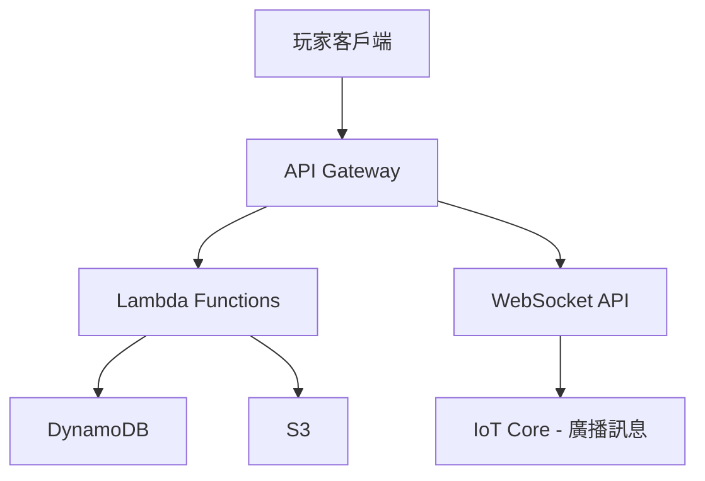
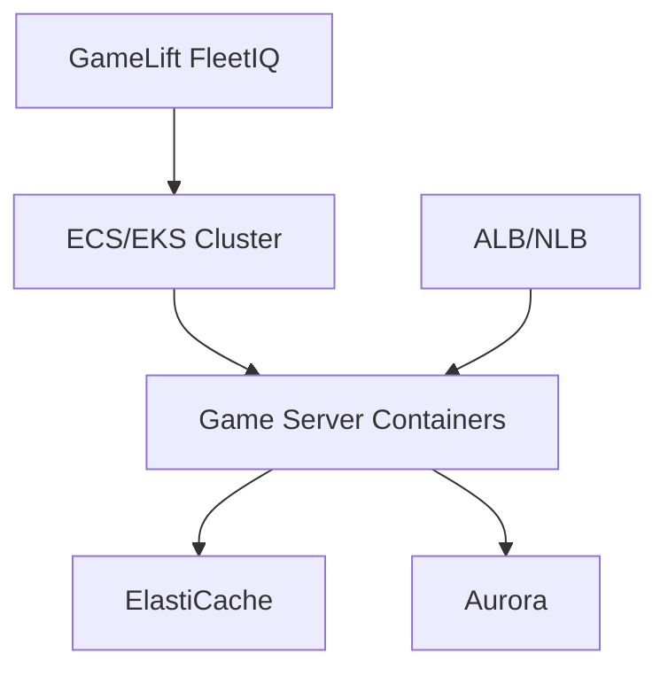
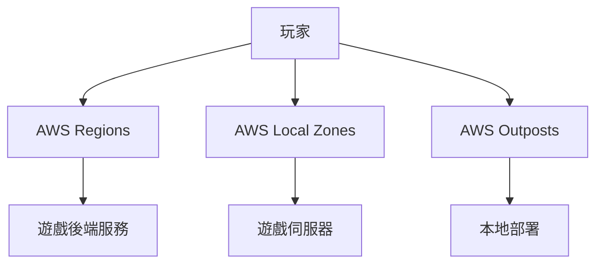

+++
title = 'AWS 遊戲架構全解析：Well-Architected Framework 導論'
date = 2025-01-22T09:00:00+08:00
draft = false
tags = ['AWS', '遊戲開發', '雲端架構', 'Well-Architected Framework', '系統設計']
categories = ['技術筆記']
author = 'Jack'
description = '深入解析 AWS Well-Architected Framework 在遊戲產業的應用，介紹六大支柱和遊戲架構最佳實踐'
toc = true
weight = 1
+++

## 前言

隨著遊戲產業的蓬勃發展，現代遊戲已不再是單純的客戶端應用程式。從百萬同時在線的 MMORPG 到全球即時對戰的電競遊戲，遊戲架構的複雜度與技術挑戰與日俱增。AWS Well-Architected Framework 提供了一套完整的方法論，幫助遊戲開發者構建安全、高效能、可擴展的雲端遊戲架構。

## AWS Well-Architected Framework 簡介

### 什麼是 Well-Architected Framework？

AWS Well-Architected Framework（WAF）是一套架構設計的最佳實踐指南，協助雲端架構師為應用程式和工作負載構建安全、高效能、彈性和高效的基礎設施。這個框架由六大支柱組成，每個支柱都提供了設計原則、最佳實踐和具體的實施建議。

### 為什麼遊戲產業需要 WAF？

遊戲產業面臨的獨特挑戰：

1. **極低延遲要求**：FPS 和 MOBA 類遊戲需要小於 50ms 的網路延遲
2. **彈性擴展需求**：新遊戲上線或活動期間，流量可能瞬間暴增 10-100 倍
3. **全球化部署**：玩家分布在全球各地，需要多地區部署策略
4. **成本控制壓力**：遊戲生命週期波動大，需要精細的成本優化
5. **安全性挑戰**：外掛、DDoS 攻擊、帳號盜用等問題層出不窮

## 六大支柱概覽

### 1. 卓越營運（Operational Excellence）

卓越營運支柱專注於運行和監控系統，以及持續改進流程和程序。對遊戲來說，這意味著：

- **自動化部署管線**：使用 CI/CD 實現遊戲版本快速迭代
- **遊戲監控系統**：實時追蹤玩家行為、伺服器健康度、遊戲平衡性
- **事件回應機制**：建立完整的 incident response playbook

#### 關鍵實踐
```yaml
監控指標：
  - 同時在線人數（CCU）
  - 平均延遲時間
  - 崩潰率
  - 支付成功率
  - 伺服器使用率
```

### 2. 安全性（Security）

安全性支柱著重於保護資訊和系統，對遊戲特別重要的面向包括：

- **防作弊機制**：客戶端驗證、伺服器端權威性
- **DDoS 防護**：使用 AWS Shield 和 CloudFront
- **玩家資料保護**：遵守 GDPR、個資法等規範
- **支付安全**：PCI DSS 合規性

### 3. 可靠性（Reliability）

可靠性支柱確保工作負載能夠執行其預期功能，並快速從故障中恢復：

- **多可用區部署**：確保單一 AZ 故障不影響遊戲服務
- **自動擴展策略**：根據玩家數量動態調整資源
- **災難復原計劃**：定期演練和測試恢復程序

### 4. 效能優化（Performance Efficiency）

效能優化支柱專注於有效使用運算資源：

- **CDN 策略**：使用 CloudFront 分發遊戲資源
- **資料庫優化**：選擇適合的資料庫（DynamoDB、Aurora、ElastiCache）
- **網路優化**：AWS Global Accelerator 降低延遲

### 5. 成本優化（Cost Optimization）

成本優化支柱幫助避免不必要的成本：

- **按需擴展**：使用 Spot Instance 處理非關鍵工作負載
- **資源標籤管理**：精確追蹤各項成本
- **Reserved Instances**：為穩定負載購買預留實例

### 6. 永續性（Sustainability）

永續性支柱關注減少環境影響：

- **區域選擇**：優先選擇使用再生能源的 AWS 區域
- **資源使用效率**：優化程式碼減少運算需求
- **綠色遊戲設計**：減少不必要的資料傳輸

## Games Industry Lens 特殊考量

AWS 特別為遊戲產業推出了 Games Industry Lens，提供產業特定的最佳實踐：

### 遊戲架構模式

#### 1. 無伺服器後端架構


適用場景：
- 回合制遊戲
- 休閒遊戲
- 社交功能

#### 2. 容器化遊戲伺服器


適用場景：
- 即時對戰遊戲
- MMORPG
- 大逃殺類遊戲

#### 3. 混合雲架構


優勢：
- 降低延遲
- 符合資料主權要求
- 彈性部署選項

## 實施路線圖

### Phase 1：評估現況（1-2 週）
1. 使用 AWS Well-Architected Tool 進行評估
2. 識別高風險問題
3. 制定改進優先順序

### Phase 2：快速改進（2-4 週）
1. 實施關鍵安全性改進
2. 建立基本監控和告警
3. 優化成本明顯過高的資源

### Phase 3：架構優化（1-3 個月）
1. 實施自動擴展
2. 建立 CI/CD 管線
3. 優化資料庫和快取策略

### Phase 4：持續改進（持續進行）
1. 定期架構審查
2. 效能調優
3. 成本優化迭代

## 關鍵技術堆疊

### 核心服務選擇
```yaml
運算層:
  - EC2: 傳統遊戲伺服器
  - Fargate: 容器化無伺服器
  - Lambda: 事件驅動邏輯
  - GameLift: 專用遊戲伺服器託管

網路層:
  - CloudFront: CDN 分發
  - Global Accelerator: 降低延遲
  - Direct Connect: 專線連接

資料層:
  - DynamoDB: NoSQL 玩家資料
  - Aurora: 關聯式資料
  - ElastiCache: 記憶體快取
  - S3: 物件儲存

分析層:
  - Kinesis: 實時資料流
  - Athena: SQL 查詢分析
  - QuickSight: 視覺化報表
```

## 成功案例預覽

在接下來的系列文章中，我們將深入探討各大遊戲公司的成功案例：

- **Epic Games**：Fortnite 如何支撐 1250 萬同時在線玩家
- **Riot Games**：League of Legends 的全球部署策略
- **Supercell**：移動遊戲的無伺服器架構實踐
- **PUBG Studios**：大逃殺遊戲的即時同步技術

## 下一步行動

1. **架構評估**：使用 AWS Well-Architected Tool 評估您的遊戲架構
2. **知識深化**：閱讀本系列後續文章，深入了解每個支柱
3. **概念驗證**：選擇一個小型專案實踐 WAF 原則
4. **社群參與**：參加 AWS GameTech 社群活動

## 總結

AWS Well-Architected Framework 為遊戲開發者提供了一套經過驗證的方法論，幫助構建世界級的遊戲架構。透過六大支柱的指導原則，遊戲團隊可以系統性地提升架構的各個面向，從而提供更好的玩家體驗，同時控制成本和風險。

在接下來的系列文章中，我們將深入探討每個支柱在遊戲架構中的具體應用，包括實際案例、程式碼範例和實施指南。無論您是獨立開發者還是大型遊戲工作室的架構師，這個系列都將為您提供實用的見解和可操作的建議。

## 延伸閱讀

- [AWS Well-Architected Framework 官方文檔](https://docs.aws.amazon.com/wellarchitected/latest/framework/)
- [AWS Games Industry Lens](https://docs.aws.amazon.com/wellarchitected/latest/games-industry-lens/)
- [AWS GameTech 資源中心](https://aws.amazon.com/gametech/)
- [遊戲開發者部落格](https://aws.amazon.com/blogs/gametech/)

---

*這是 AWS 遊戲架構系列的第一篇文章。下一篇我們將深入探討「卓越營運」支柱，了解如何建立高效的遊戲營運體系。*