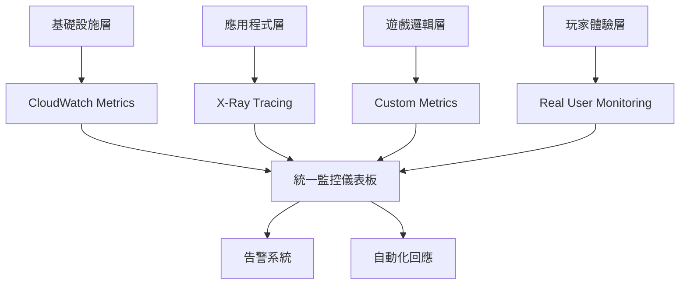

+++
title = '遊戲營運卓越之道：自動化、監控與持續改進'
date = 2025-09-22T10:00:00+08:00
draft = false
tags = ['AWS', '遊戲營運', 'DevOps', 'CI/CD', '監控系統', 'GameOps']
categories = ['技術筆記']
author = 'Jack'
description = '深入探討 AWS Well-Architected Framework 的卓越營運支柱在遊戲產業的應用，包含自動化部署、即時監控和事件回應'
toc = true
weight = 2
+++

## 前言

在競爭激烈的遊戲市場中，營運效率往往決定了遊戲的成敗。一個小時的停機可能導致數十萬美元的損失和大量玩家流失。AWS Well-Architected Framework 的卓越營運支柱，為遊戲團隊提供了一套完整的方法論，幫助建立高效、可靠的營運體系。本文將深入探討如何在遊戲產業實踐卓越營運。

## 卓越營運的核心理念

### 設計原則

1. **將營運作為程式碼**（Operations as Code）
2. **經常進行小型、可逆的變更**
3. **經常改進營運程序**
4. **預測故障**
5. **從所有營運故障中學習**

### 遊戲產業的特殊挑戰

- **24/7 不間斷服務**：玩家遍布全球，任何時間都有活躍用戶
- **頻繁版本更新**：活動、平衡調整、新內容需要快速部署
- **尖峰流量處理**：新遊戲上線、節日活動帶來的瞬間高流量
- **即時問題處理**：遊戲 Bug 需要立即修復，否則影響玩家體驗

## 自動化部署管線

### 現代遊戲 CI/CD 架構


### 實施範例：使用 AWS CodePipeline

```yaml
# buildspec.yml - 遊戲伺服器構建配置
version: 0.2

phases:
  pre_build:
    commands:
      - echo Logging in to Amazon ECR...
      - aws ecr get-login-password --region $AWS_DEFAULT_REGION | docker login --username AWS --password-stdin $AWS_ACCOUNT_ID.dkr.ecr.$AWS_DEFAULT_REGION.amazonaws.com
      - REPOSITORY_URI=$AWS_ACCOUNT_ID.dkr.ecr.$AWS_DEFAULT_REGION.amazonaws.com/$IMAGE_REPO_NAME
      - IMAGE_TAG=${CODEBUILD_RESOLVED_SOURCE_VERSION:0:7}

  build:
    commands:
      - echo Building game server...
      - cmake .
      - make
      - docker build -t $REPOSITORY_URI:latest .
      - docker tag $REPOSITORY_URI:latest $REPOSITORY_URI:$IMAGE_TAG

  post_build:
    commands:
      - echo Pushing Docker images...
      - docker push $REPOSITORY_URI:latest
      - docker push $REPOSITORY_URI:$IMAGE_TAG
      - echo Writing image definitions file...
      - printf '[{"name":"game-server","imageUri":"%s"}]' $REPOSITORY_URI:$IMAGE_TAG > imagedefinitions.json

artifacts:
  files:
    - imagedefinitions.json
    - deployment/ecs-task-definition.json
```

### 藍綠部署策略

```python
# blue_green_deployment.py
import boto3
import time
from typing import Dict, Any

class GameServerDeployment:
    def __init__(self):
        self.ecs = boto3.client('ecs')
        self.elbv2 = boto3.client('elbv2')
        self.cloudwatch = boto3.client('cloudwatch')

    def deploy_new_version(self,
                          cluster: str,
                          service: str,
                          new_task_definition: str) -> bool:
        """
        執行藍綠部署
        """
        try:
            # 1. 創建新的任務定義
            response = self.ecs.register_task_definition(
                **new_task_definition
            )
            new_task_def_arn = response['taskDefinition']['taskDefinitionArn']

            # 2. 更新服務使用新任務定義
            self.ecs.update_service(
                cluster=cluster,
                service=service,
                taskDefinition=new_task_def_arn,
                deploymentConfiguration={
                    'deploymentCircuitBreaker': {
                        'enable': True,
                        'rollback': True
                    },
                    'maximumPercent': 200,
                    'minimumHealthyPercent': 100
                }
            )

            # 3. 監控部署狀態
            return self._monitor_deployment(cluster, service)

        except Exception as e:
            print(f"Deployment failed: {str(e)}")
            self._rollback(cluster, service)
            return False

    def _monitor_deployment(self, cluster: str, service: str) -> bool:
        """
        監控部署進度和健康狀態
        """
        max_attempts = 60  # 最多等待 30 分鐘
        attempt = 0

        while attempt < max_attempts:
            service_desc = self.ecs.describe_services(
                cluster=cluster,
                services=[service]
            )['services'][0]

            deployments = service_desc['deployments']

            # 檢查是否只有一個活躍的部署（表示完成）
            if len(deployments) == 1 and deployments[0]['status'] == 'PRIMARY':
                print("Deployment completed successfully!")
                return True

            # 檢查錯誤指標
            if self._check_error_metrics(service):
                print("High error rate detected, initiating rollback...")
                return False

            time.sleep(30)
            attempt += 1

        return False

    def _check_error_metrics(self, service: str) -> bool:
        """
        檢查錯誤率是否超過閾值
        """
        response = self.cloudwatch.get_metric_statistics(
            Namespace='GameServer/Metrics',
            MetricName='ErrorRate',
            Dimensions=[
                {'Name': 'ServiceName', 'Value': service}
            ],
            StartTime=time.time() - 300,
            EndTime=time.time(),
            Period=60,
            Statistics=['Average']
        )

        if response['Datapoints']:
            latest_error_rate = response['Datapoints'][-1]['Average']
            return latest_error_rate > 5.0  # 錯誤率超過 5%

        return False
```

## 監控與可觀察性

### 四層監控架構



### 關鍵監控指標

```python
# game_metrics.py
import boto3
import json
from datetime import datetime
from typing import List, Dict

class GameMetricsCollector:
    def __init__(self):
        self.cloudwatch = boto3.client('cloudwatch')
        self.namespace = 'GameServer/Metrics'

    def publish_metrics(self):
        """
        發布遊戲核心指標到 CloudWatch
        """
        metrics = []

        # 1. 玩家指標
        metrics.extend(self._collect_player_metrics())

        # 2. 效能指標
        metrics.extend(self._collect_performance_metrics())

        # 3. 業務指標
        metrics.extend(self._collect_business_metrics())

        # 批量發送到 CloudWatch
        self._send_to_cloudwatch(metrics)

    def _collect_player_metrics(self) -> List[Dict]:
        """
        收集玩家相關指標
        """
        return [
            {
                'MetricName': 'ConcurrentUsers',
                'Value': self._get_concurrent_users(),
                'Unit': 'Count',
                'Timestamp': datetime.utcnow()
            },
            {
                'MetricName': 'NewPlayerRegistrations',
                'Value': self._get_new_registrations(),
                'Unit': 'Count',
                'Timestamp': datetime.utcnow()
            },
            {
                'MetricName': 'PlayerChurnRate',
                'Value': self._calculate_churn_rate(),
                'Unit': 'Percent',
                'Timestamp': datetime.utcnow()
            },
            {
                'MetricName': 'AverageSessionDuration',
                'Value': self._get_avg_session_duration(),
                'Unit': 'Seconds',
                'Timestamp': datetime.utcnow()
            }
        ]

    def _collect_performance_metrics(self) -> List[Dict]:
        """
        收集效能相關指標
        """
        return [
            {
                'MetricName': 'ServerTickRate',
                'Value': self._get_tick_rate(),
                'Unit': 'Count/Second',
                'Timestamp': datetime.utcnow()
            },
            {
                'MetricName': 'AverageLatency',
                'Value': self._get_avg_latency(),
                'Unit': 'Milliseconds',
                'Timestamp': datetime.utcnow()
            },
            {
                'MetricName': 'PacketLossRate',
                'Value': self._get_packet_loss(),
                'Unit': 'Percent',
                'Timestamp': datetime.utcnow()
            },
            {
                'MetricName': 'MemoryUsage',
                'Value': self._get_memory_usage(),
                'Unit': 'Percent',
                'Timestamp': datetime.utcnow()
            }
        ]

    def _collect_business_metrics(self) -> List[Dict]:
        """
        收集業務相關指標
        """
        return [
            {
                'MetricName': 'TransactionVolume',
                'Value': self._get_transaction_volume(),
                'Unit': 'Count',
                'Timestamp': datetime.utcnow()
            },
            {
                'MetricName': 'ARPU',  # Average Revenue Per User
                'Value': self._calculate_arpu(),
                'Unit': 'None',
                'Timestamp': datetime.utcnow()
            },
            {
                'MetricName': 'PaymentSuccessRate',
                'Value': self._get_payment_success_rate(),
                'Unit': 'Percent',
                'Timestamp': datetime.utcnow()
            }
        ]

    def _send_to_cloudwatch(self, metrics: List[Dict]):
        """
        批量發送指標到 CloudWatch
        """
        # CloudWatch 限制每次最多發送 20 個指標
        for i in range(0, len(metrics), 20):
            batch = metrics[i:i+20]
            self.cloudwatch.put_metric_data(
                Namespace=self.namespace,
                MetricData=batch
            )
```

### 即時監控儀表板配置

```json
{
  "dashboardName": "GameOperations",
  "dashboardBody": {
    "widgets": [
      {
        "type": "metric",
        "properties": {
          "metrics": [
            ["GameServer/Metrics", "ConcurrentUsers", {"stat": "Average"}],
            ["...", {"stat": "Maximum"}]
          ],
          "period": 300,
          "stat": "Average",
          "region": "us-east-1",
          "title": "同時在線玩家數"
        }
      },
      {
        "type": "metric",
        "properties": {
          "metrics": [
            ["GameServer/Metrics", "AverageLatency", {"stat": "p99"}],
            ["...", {"stat": "p95"}],
            ["...", {"stat": "p50"}]
          ],
          "period": 60,
          "stat": "Average",
          "region": "us-east-1",
          "title": "網路延遲分布"
        }
      },
      {
        "type": "metric",
        "properties": {
          "metrics": [
            ["GameServer/Metrics", "ErrorRate"],
            ["GameServer/Metrics", "ServerCrashRate"]
          ],
          "period": 300,
          "stat": "Sum",
          "region": "us-east-1",
          "title": "錯誤率監控",
          "annotations": {
            "alarms": ["arn:aws:cloudwatch:region:account:alarm:HighErrorRate"]
          }
        }
      }
    ]
  }
}
```

## 事件管理與回應

### 分級告警系統

```python
# alert_management.py
from enum import Enum
from typing import Dict, List, Optional
import boto3
import json

class AlertSeverity(Enum):
    CRITICAL = 1  # 需要立即處理
    HIGH = 2      # 30分鐘內處理
    MEDIUM = 3    # 2小時內處理
    LOW = 4       # 下個工作日處理

class GameAlertManager:
    def __init__(self):
        self.sns = boto3.client('sns')
        self.ssm = boto3.client('ssm')
        self.severity_rules = self._load_severity_rules()

    def _load_severity_rules(self) -> Dict:
        """
        載入告警嚴重性規則
        """
        return {
            'ServerDown': AlertSeverity.CRITICAL,
            'HighErrorRate': AlertSeverity.CRITICAL,
            'PaymentSystemFailure': AlertSeverity.CRITICAL,
            'DatabaseConnectionLost': AlertSeverity.HIGH,
            'HighLatency': AlertSeverity.HIGH,
            'LowDiskSpace': AlertSeverity.MEDIUM,
            'HighCPUUsage': AlertSeverity.MEDIUM,
            'SlowQueries': AlertSeverity.LOW
        }

    def process_alert(self, alert_type: str, details: Dict):
        """
        處理告警並執行相應動作
        """
        severity = self.severity_rules.get(alert_type, AlertSeverity.LOW)

        # 記錄告警
        self._log_alert(alert_type, severity, details)

        # 根據嚴重性執行不同動作
        if severity == AlertSeverity.CRITICAL:
            self._handle_critical(alert_type, details)
        elif severity == AlertSeverity.HIGH:
            self._handle_high(alert_type, details)
        else:
            self._handle_normal(alert_type, details)

    def _handle_critical(self, alert_type: str, details: Dict):
        """
        處理關鍵告警
        """
        # 1. 立即通知所有值班人員
        self._page_on_call_team(alert_type, details)

        # 2. 執行自動恢復程序
        if alert_type == 'ServerDown':
            self._auto_restart_server(details.get('server_id'))
        elif alert_type == 'PaymentSystemFailure':
            self._switch_to_backup_payment()

        # 3. 創建事故工單
        self._create_incident_ticket(alert_type, details, priority='P1')

    def _auto_restart_server(self, server_id: str):
        """
        自動重啟遊戲伺服器
        """
        try:
            # 執行重啟腳本
            response = self.ssm.send_command(
                InstanceIds=[server_id],
                DocumentName='AWS-RunShellScript',
                Parameters={
                    'commands': [
                        'systemctl restart game-server',
                        'systemctl status game-server'
                    ]
                }
            )

            command_id = response['Command']['CommandId']

            # 等待執行結果
            waiter = self.ssm.get_waiter('command_executed')
            waiter.wait(
                CommandId=command_id,
                InstanceId=server_id
            )

            print(f"Server {server_id} restarted successfully")

        except Exception as e:
            print(f"Failed to restart server: {str(e)}")
            # 啟動備用伺服器
            self._launch_backup_server()
```

### 自動化運維腳本

```python
# auto_remediation.py
import boto3
import time
from typing import Dict, List

class AutoRemediation:
    def __init__(self):
        self.ec2 = boto3.client('ec2')
        self.autoscaling = boto3.client('autoscaling')
        self.ecs = boto3.client('ecs')

    def remediate_high_load(self, cluster_name: str):
        """
        自動處理高負載情況
        """
        # 1. 立即增加實例
        self._scale_out_immediately(cluster_name)

        # 2. 優化任務分配
        self._rebalance_game_sessions(cluster_name)

        # 3. 啟用緩存層
        self._enable_aggressive_caching()

    def _scale_out_immediately(self, cluster_name: str):
        """
        立即擴展遊戲伺服器
        """
        # 獲取當前容量
        response = self.autoscaling.describe_auto_scaling_groups(
            AutoScalingGroupNames=[f'{cluster_name}-asg']
        )

        if response['AutoScalingGroups']:
            asg = response['AutoScalingGroups'][0]
            current_capacity = asg['DesiredCapacity']

            # 增加 50% 容量
            new_capacity = int(current_capacity * 1.5)

            self.autoscaling.set_desired_capacity(
                AutoScalingGroupName=f'{cluster_name}-asg',
                DesiredCapacity=new_capacity,
                HonorCooldown=False  # 忽略冷卻期
            )

            print(f"Scaled out from {current_capacity} to {new_capacity} instances")

    def remediate_database_issues(self):
        """
        自動處理資料庫問題
        """
        # 1. 檢查並殺死慢查詢
        self._kill_slow_queries()

        # 2. 切換到只讀副本
        self._promote_read_replica()

        # 3. 清理連接池
        self._reset_connection_pools()
```

## 遊戲活動管理

### 活動部署自動化

```python
# event_deployment.py
import boto3
import json
from datetime import datetime, timedelta
from typing import Dict, List

class GameEventManager:
    def __init__(self):
        self.s3 = boto3.client('s3')
        self.cloudfront = boto3.client('cloudfront')
        self.lambda_client = boto3.client('lambda')
        self.eventbridge = boto3.client('events')

    def schedule_event(self, event_config: Dict):
        """
        排程遊戲活動
        """
        event_name = event_config['name']
        start_time = event_config['start_time']
        end_time = event_config['end_time']

        # 1. 上傳活動配置到 S3
        self._upload_event_config(event_config)

        # 2. 創建 EventBridge 規則自動開始活動
        self._create_event_rule(
            rule_name=f"start-{event_name}",
            schedule_expression=f"at({start_time})",
            target_function="StartGameEvent"
        )

        # 3. 創建結束活動規則
        self._create_event_rule(
            rule_name=f"end-{event_name}",
            schedule_expression=f"at({end_time})",
            target_function="EndGameEvent"
        )

        # 4. 預熱 CDN
        self._preheat_cdn(event_config.get('assets', []))

    def _upload_event_config(self, config: Dict):
        """
        上傳活動配置
        """
        self.s3.put_object(
            Bucket='game-events-bucket',
            Key=f"events/{config['name']}/config.json",
            Body=json.dumps(config),
            ContentType='application/json'
        )

    def _preheat_cdn(self, assets: List[str]):
        """
        預熱 CDN 快取
        """
        if not assets:
            return

        # 創建預熱請求
        invalidation = {
            'Paths': {
                'Quantity': len(assets),
                'Items': assets
            },
            'CallerReference': f"preheat-{datetime.now().isoformat()}"
        }

        self.cloudfront.create_invalidation(
            DistributionId='EXAMPLE_DISTRIBUTION_ID',
            InvalidationBatch=invalidation
        )

        print(f"Pre-heated {len(assets)} assets in CDN")

    def deploy_hotfix(self, fix_package: Dict):
        """
        部署緊急修復
        """
        # 1. 驗證修復包
        if not self._validate_hotfix(fix_package):
            raise ValueError("Hotfix validation failed")

        # 2. 備份當前版本
        backup_id = self._backup_current_version()

        # 3. 部署修復
        try:
            # 更新 Lambda 函數
            for function_name, code in fix_package['functions'].items():
                self.lambda_client.update_function_code(
                    FunctionName=function_name,
                    S3Bucket=code['bucket'],
                    S3Key=code['key']
                )

            # 更新配置
            for key, value in fix_package['configs'].items():
                self._update_config(key, value)

            print("Hotfix deployed successfully")

        except Exception as e:
            print(f"Hotfix failed: {str(e)}, rolling back...")
            self._rollback_to_backup(backup_id)
            raise
```

## 日誌管理與分析

### 集中式日誌架構

```python
# log_management.py
import boto3
import json
from typing import Dict, List
import re

class GameLogAnalyzer:
    def __init__(self):
        self.logs = boto3.client('logs')
        self.s3 = boto3.client('s3')
        self.athena = boto3.client('athena')

    def analyze_player_behavior(self, time_range: Dict) -> Dict:
        """
        分析玩家行為模式
        """
        query = """
        SELECT
            player_id,
            action_type,
            COUNT(*) as action_count,
            AVG(duration) as avg_duration,
            SUM(in_game_currency_spent) as total_spent
        FROM game_logs
        WHERE timestamp BETWEEN %(start_time)s AND %(end_time)s
        GROUP BY player_id, action_type
        ORDER BY action_count DESC
        """

        results = self._run_athena_query(query, time_range)

        return self._process_behavior_results(results)

    def detect_anomalies(self) -> List[Dict]:
        """
        檢測異常行為
        """
        # 使用 CloudWatch Logs Insights
        query = """
        fields @timestamp, player_id, action, value
        | filter action in ["purchase", "level_up", "item_acquire"]
        | stats avg(value) as avg_value,
                stddev(value) as std_value
                by bin(5m) as time_bucket
        | filter value > avg_value + (3 * std_value)
        """

        response = self.logs.start_query(
            logGroupName='/aws/lambda/game-server',
            startTime=int((datetime.now() - timedelta(hours=1)).timestamp()),
            endTime=int(datetime.now().timestamp()),
            queryString=query
        )

        # 等待查詢完成
        query_id = response['queryId']
        results = self._wait_for_query_results(query_id)

        anomalies = []
        for result in results:
            if self._is_suspicious(result):
                anomalies.append({
                    'player_id': result['player_id'],
                    'action': result['action'],
                    'value': result['value'],
                    'severity': self._calculate_severity(result)
                })

        return anomalies

    def generate_operational_report(self) -> Dict:
        """
        生成營運報告
        """
        report = {
            'timestamp': datetime.now().isoformat(),
            'metrics': {},
            'incidents': [],
            'recommendations': []
        }

        # 收集關鍵指標
        report['metrics'] = {
            'daily_active_users': self._get_dau(),
            'revenue': self._get_daily_revenue(),
            'server_uptime': self._calculate_uptime(),
            'average_latency': self._get_average_latency(),
            'error_rate': self._get_error_rate()
        }

        # 收集事件
        report['incidents'] = self._get_incidents_last_24h()

        # 生成建議
        report['recommendations'] = self._generate_recommendations(report['metrics'])

        # 儲存報告
        self._save_report(report)

        return report
```

## 成本優化的營運實踐

### 智能資源調度

```python
# resource_scheduler.py
import boto3
from datetime import datetime, time
from typing import List, Dict

class GameResourceScheduler:
    def __init__(self):
        self.ec2 = boto3.client('ec2')
        self.rds = boto3.client('rds')
        self.autoscaling = boto3.client('autoscaling')

    def optimize_by_player_pattern(self):
        """
        根據玩家活躍模式優化資源
        """
        current_hour = datetime.now().hour

        # 定義不同時段的資源配置
        if 2 <= current_hour < 8:  # 深夜低谷期
            self._configure_minimum_resources()
        elif 8 <= current_hour < 12:  # 上午成長期
            self._configure_moderate_resources()
        elif 12 <= current_hour < 14:  # 午休高峰期
            self._configure_peak_resources()
        elif 14 <= current_hour < 18:  # 下午平穩期
            self._configure_moderate_resources()
        elif 18 <= current_hour < 24:  # 晚間高峰期
            self._configure_peak_resources()
        else:  # 凌晨下降期
            self._configure_moderate_resources()

    def _configure_minimum_resources(self):
        """
        配置最小資源（節省成本）
        """
        # 縮減 Auto Scaling Group
        self.autoscaling.set_desired_capacity(
            AutoScalingGroupName='game-server-asg',
            DesiredCapacity=2,
            MinSize=2,
            MaxSize=10
        )

        # 縮減 RDS 實例規格
        self.rds.modify_db_instance(
            DBInstanceIdentifier='game-database',
            DBInstanceClass='db.t3.medium',
            ApplyImmediately=False
        )

        print("Configured minimum resources for off-peak hours")

    def schedule_spot_instances(self, schedule: List[Dict]):
        """
        排程 Spot 實例以降低成本
        """
        for task in schedule:
            if task['type'] == 'batch_processing':
                # 使用 Spot 實例處理批次任務
                self._launch_spot_fleet(
                    instance_count=task['instance_count'],
                    duration=task['duration'],
                    max_price=task['max_price']
                )
```

## 最佳實踐總結

### 1. 自動化一切
- **基礎設施即代碼**：使用 CloudFormation 或 Terraform
- **配置管理**：使用 AWS Systems Manager Parameter Store
- **自動化測試**：單元測試、整合測試、負載測試

### 2. 可觀察性設計
- **結構化日誌**：使用 JSON 格式便於查詢
- **分散式追蹤**：使用 X-Ray 追蹤請求流程
- **自定義指標**：追蹤遊戲特定的業務指標

### 3. 快速恢復能力
- **自動化恢復**：設計自愈系統
- **災難演練**：定期進行故障演練
- **回滾機制**：確保能快速回滾到穩定版本

### 4. 持續學習改進
- **事後檢討**：每次事故後進行根因分析
- **知識共享**：建立營運知識庫
- **指標驅動**：基於數據做決策

## 實戰案例：大型 MOBA 遊戲的營運體系

某知名 MOBA 遊戲透過實施卓越營運實踐，達到以下成果：

- **部署頻率提升 300%**：從每週 1 次到每日 3 次
- **平均恢復時間縮短 85%**：從 45 分鐘降至 7 分鐘
- **營運成本降低 40%**：透過自動化和資源優化
- **玩家滿意度提升 25%**：更快的問題回應和修復

## 總結

卓越營運不僅是技術實踐，更是一種文化。透過自動化、監控、快速回應和持續改進，遊戲團隊可以提供更穩定、更優質的遊戲體驗。AWS 提供的豐富工具和服務，為遊戲營運團隊提供了強大的支援，幫助實現真正的營運卓越。

在下一篇文章中，我們將探討安全性支柱，了解如何保護遊戲和玩家免受各種威脅。

## 延伸閱讀

- [AWS Systems Manager 運維最佳實踐](https://docs.aws.amazon.com/systems-manager/)
- [遊戲產業 DevOps 實踐指南](https://aws.amazon.com/gametech/devops/)
- [CloudWatch 監控最佳實踐](https://docs.aws.amazon.com/AmazonCloudWatch/latest/monitoring/)
- [AWS 事件管理框架](https://aws.amazon.com/event-driven-architecture/)

---

*這是 AWS 遊戲架構系列的第二篇文章。下一篇我們將深入探討「安全性」支柱，了解如何構建安全可靠的遊戲平台。*