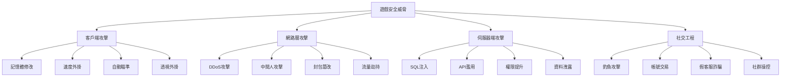

+++
title = '遊戲安全防護指南：從防作弊到資料保護的全方位策略'
date = 2025-01-22T11:00:00+08:00
draft = false
tags = ['AWS', '遊戲安全', '防作弊', 'DDoS防護', '資料保護', '雲端安全']
categories = ['技術筆記']
author = 'Jack'
description = '探討 AWS Well-Architected Framework 安全性支柱在遊戲產業的應用，涵蓋防作弊、DDoS防護、玩家資料保護等關鍵議題'
toc = true
weight = 3
+++

## 前言

遊戲安全是一場永無止境的攻防戰。從外掛作弊到 DDoS 攻擊，從帳號盜用到虛擬資產竊取，遊戲面臨的安全威脅日趨複雜多樣。根據統計，超過 77% 的線上遊戲都曾遭受過某種形式的安全攻擊，每年因安全問題造成的損失高達數十億美元。本文將深入探討如何運用 AWS Well-Architected Framework 的安全性支柱，構建堅不可摧的遊戲安全防線。

## 遊戲安全威脅全景

### 常見攻擊類型與影響



### 安全事件影響評估

| 威脅類型 | 直接損失 | 間接影響 | 恢復時間 |
|---------|---------|---------|---------|
| DDoS 攻擊 | $10K-100K/小時 | 玩家流失、聲譽受損 | 1-24 小時 |
| 外掛氾濫 | 30-50% 玩家流失 | 遊戲平衡破壞 | 數週至數月 |
| 資料洩露 | $150-300/條記錄 | 法律訴訟、監管處罰 | 6-12 個月 |
| 虛擬資產盜竊 | 直接經濟損失 | 玩家信任危機 | 1-7 天 |

## 深度防禦架構設計

### 多層安全防護體系

```python
# security_architecture.py
from typing import Dict, List, Optional
import boto3
import hashlib
import hmac
import json
from enum import Enum

class SecurityLayer(Enum):
    EDGE = "邊緣防護"
    NETWORK = "網路層"
    APPLICATION = "應用層"
    DATA = "資料層"
    IDENTITY = "身份層"

class GameSecurityArchitecture:
    def __init__(self):
        self.waf = boto3.client('wafv2')
        self.shield = boto3.client('shield')
        self.guardduty = boto3.client('guardduty')
        self.kms = boto3.client('kms')
        self.cognito = boto3.client('cognito-idp')

    def implement_defense_in_depth(self) -> Dict:
        """
        實施深度防禦策略
        """
        security_controls = {}

        # 1. 邊緣層防護
        security_controls[SecurityLayer.EDGE] = self._configure_edge_security()

        # 2. 網路層防護
        security_controls[SecurityLayer.NETWORK] = self._configure_network_security()

        # 3. 應用層防護
        security_controls[SecurityLayer.APPLICATION] = self._configure_app_security()

        # 4. 資料層防護
        security_controls[SecurityLayer.DATA] = self._configure_data_security()

        # 5. 身份層防護
        security_controls[SecurityLayer.IDENTITY] = self._configure_identity_security()

        return security_controls

    def _configure_edge_security(self) -> Dict:
        """
        配置邊緣層安全
        """
        # 創建 WAF Web ACL
        web_acl = self.waf.create_web_acl(
            Name='game-protection-acl',
            Scope='CLOUDFRONT',
            DefaultAction={'Allow': {}},
            Rules=[
                {
                    'Name': 'RateLimitRule',
                    'Priority': 1,
                    'Statement': {
                        'RateBasedStatement': {
                            'Limit': 2000,
                            'AggregateKeyType': 'IP'
                        }
                    },
                    'Action': {'Block': {}},
                    'VisibilityConfig': {
                        'SampledRequestsEnabled': True,
                        'CloudWatchMetricsEnabled': True,
                        'MetricName': 'RateLimitRule'
                    }
                },
                {
                    'Name': 'GeoBlockingRule',
                    'Priority': 2,
                    'Statement': {
                        'GeoMatchStatement': {
                            'CountryCodes': ['CN', 'RU', 'KP']  # 高風險國家
                        }
                    },
                    'Action': {'Block': {}},
                    'VisibilityConfig': {
                        'SampledRequestsEnabled': True,
                        'CloudWatchMetricsEnabled': True,
                        'MetricName': 'GeoBlockingRule'
                    }
                },
                {
                    'Name': 'SQLiXSSProtection',
                    'Priority': 3,
                    'Statement': {
                        'OrStatement': {
                            'Statements': [
                                {
                                    'SqliMatchStatement': {
                                        'FieldToMatch': {'AllQueryArguments': {}},
                                        'TextTransformations': [
                                            {'Priority': 0, 'Type': 'URL_DECODE'},
                                            {'Priority': 1, 'Type': 'HTML_ENTITY_DECODE'}
                                        ]
                                    }
                                },
                                {
                                    'XssMatchStatement': {
                                        'FieldToMatch': {'Body': {}},
                                        'TextTransformations': [
                                            {'Priority': 0, 'Type': 'NONE'}
                                        ]
                                    }
                                }
                            ]
                        }
                    },
                    'Action': {'Block': {}},
                    'VisibilityConfig': {
                        'SampledRequestsEnabled': True,
                        'CloudWatchMetricsEnabled': True,
                        'MetricName': 'SQLiXSSProtection'
                    }
                }
            ],
            VisibilityConfig={
                'SampledRequestsEnabled': True,
                'CloudWatchMetricsEnabled': True,
                'MetricName': 'game-protection-acl'
            }
        )

        return {
            'web_acl_id': web_acl['Summary']['Id'],
            'rules_configured': 3
        }
```

## 防作弊系統設計

### 客戶端反作弊機制

```python
# anti_cheat_client.py
import struct
import time
from typing import Any, Dict, List
import hashlib
import random

class ClientAntiCheat:
    def __init__(self):
        self.integrity_checks = []
        self.heartbeat_interval = 30  # 秒
        self.last_heartbeat = time.time()

    def memory_integrity_check(self) -> bool:
        """
        記憶體完整性檢查
        """
        critical_values = {
            'player_health': self._get_player_health(),
            'player_position': self._get_player_position(),
            'player_speed': self._get_player_speed(),
            'weapon_damage': self._get_weapon_damage()
        }

        # 檢查數值是否在合理範圍內
        validations = {
            'player_health': lambda x: 0 <= x <= 100,
            'player_position': lambda p: self._is_valid_position(p),
            'player_speed': lambda s: s <= 10.0,  # 最大速度 10 單位/秒
            'weapon_damage': lambda d: d in self._get_valid_damage_values()
        }

        for key, value in critical_values.items():
            if not validations[key](value):
                self._report_violation(f"Invalid {key}: {value}")
                return False

        return True

    def process_integrity_check(self) -> Dict:
        """
        進程完整性檢查
        """
        suspicious_processes = [
            'cheatengine', 'artmoney', 'speedhack',
            'injector', 'debugger', 'ollydbg'
        ]

        running_processes = self._get_running_processes()
        detected = []

        for proc in running_processes:
            proc_name = proc.lower()
            for suspicious in suspicious_processes:
                if suspicious in proc_name:
                    detected.append(proc)
                    break

        if detected:
            return {
                'status': 'violation',
                'detected_processes': detected
            }

        return {'status': 'clean'}

    def network_packet_validation(self, packet: bytes) -> bool:
        """
        網路封包驗證
        """
        # 解析封包頭
        if len(packet) < 16:
            return False

        packet_id, timestamp, checksum = struct.unpack('!IIQ', packet[:16])
        payload = packet[16:]

        # 驗證時間戳
        current_time = int(time.time())
        if abs(current_time - timestamp) > 60:  # 允許 60 秒的時間差
            self._report_violation(f"Invalid timestamp: {timestamp}")
            return False

        # 驗證校驗和
        calculated_checksum = self._calculate_checksum(payload)
        if calculated_checksum != checksum:
            self._report_violation("Packet checksum mismatch")
            return False

        # 驗證封包序列
        if not self._validate_packet_sequence(packet_id):
            self._report_violation(f"Invalid packet sequence: {packet_id}")
            return False

        return True

    def behavioral_analysis(self, actions: List[Dict]) -> Dict:
        """
        行為分析檢測
        """
        anomalies = []

        # 檢測不人性化的操作模式
        if self._detect_inhuman_patterns(actions):
            anomalies.append('inhuman_patterns')

        # 檢測重複模式（可能是腳本）
        if self._detect_repetitive_patterns(actions):
            anomalies.append('bot_behavior')

        # 檢測不可能的反應時間
        if self._detect_impossible_reactions(actions):
            anomalies.append('impossible_reactions')

        return {
            'anomalies': anomalies,
            'confidence': len(anomalies) * 0.33,
            'should_flag': len(anomalies) >= 2
        }

    def _detect_inhuman_patterns(self, actions: List[Dict]) -> bool:
        """
        檢測非人類操作模式
        """
        # 分析點擊間隔
        click_intervals = []
        for i in range(1, len(actions)):
            if actions[i]['type'] == 'click' and actions[i-1]['type'] == 'click':
                interval = actions[i]['timestamp'] - actions[i-1]['timestamp']
                click_intervals.append(interval)

        if not click_intervals:
            return False

        # 人類點擊間隔通常有變化
        std_dev = self._calculate_std_dev(click_intervals)
        if std_dev < 0.01:  # 間隔太一致，可能是自動點擊
            return True

        return False
```

### 伺服器端驗證系統

```python
# server_validation.py
import asyncio
from typing import Dict, List, Optional, Tuple
import numpy as np
from collections import deque
import time

class ServerSideValidation:
    def __init__(self):
        self.player_states = {}
        self.validation_rules = self._load_validation_rules()
        self.ml_model = self._load_ml_model()

    def validate_player_action(self,
                              player_id: str,
                              action: Dict) -> Tuple[bool, Optional[str]]:
        """
        驗證玩家動作的合法性
        """
        # 1. 基礎規則驗證
        rule_check = self._check_basic_rules(player_id, action)
        if not rule_check[0]:
            return rule_check

        # 2. 狀態一致性驗證
        state_check = self._check_state_consistency(player_id, action)
        if not state_check[0]:
            return state_check

        # 3. 時序邏輯驗證
        timing_check = self._check_timing_logic(player_id, action)
        if not timing_check[0]:
            return timing_check

        # 4. 機器學習異常檢測
        ml_check = self._ml_anomaly_detection(player_id, action)
        if not ml_check[0]:
            return ml_check

        # 更新玩家狀態
        self._update_player_state(player_id, action)

        return True, None

    def _check_basic_rules(self, player_id: str, action: Dict) -> Tuple[bool, Optional[str]]:
        """
        基礎規則檢查
        """
        action_type = action.get('type')

        if action_type == 'move':
            # 檢查移動速度
            speed = self._calculate_speed(
                action['from_position'],
                action['to_position'],
                action['duration']
            )

            max_speed = self.validation_rules['max_movement_speed']
            if speed > max_speed:
                return False, f"Movement speed {speed} exceeds maximum {max_speed}"

            # 檢查位置合法性
            if not self._is_valid_position(action['to_position']):
                return False, "Invalid position"

        elif action_type == 'attack':
            # 檢查攻擊距離
            distance = self._calculate_distance(
                action['attacker_position'],
                action['target_position']
            )

            max_range = self.validation_rules['weapons'][action['weapon']]['range']
            if distance > max_range:
                return False, f"Attack range {distance} exceeds weapon range {max_range}"

            # 檢查攻擊頻率
            if not self._check_attack_cooldown(player_id, action['weapon']):
                return False, "Attack on cooldown"

        elif action_type == 'item_use':
            # 檢查物品擁有權
            if not self._player_has_item(player_id, action['item_id']):
                return False, "Player doesn't own this item"

            # 檢查物品使用條件
            if not self._can_use_item(player_id, action['item_id']):
                return False, "Item usage conditions not met"

        return True, None

    def _check_state_consistency(self, player_id: str, action: Dict) -> Tuple[bool, Optional[str]]:
        """
        狀態一致性檢查
        """
        if player_id not in self.player_states:
            self.player_states[player_id] = self._init_player_state()

        player_state = self.player_states[player_id]

        # 檢查狀態轉換的合法性
        current_state = player_state['current_state']
        new_state = self._determine_new_state(action)

        if not self._is_valid_state_transition(current_state, new_state):
            return False, f"Invalid state transition from {current_state} to {new_state}"

        # 檢查資源消耗
        resource_cost = self._calculate_resource_cost(action)
        if not self._has_sufficient_resources(player_id, resource_cost):
            return False, "Insufficient resources"

        return True, None

    def _ml_anomaly_detection(self, player_id: str, action: Dict) -> Tuple[bool, Optional[str]]:
        """
        機器學習異常檢測
        """
        # 準備特徵向量
        features = self._extract_features(player_id, action)

        # 使用訓練好的模型預測
        anomaly_score = self.ml_model.predict_proba([features])[0][1]

        if anomaly_score > 0.85:  # 高度懷疑
            return False, f"ML detected anomaly (score: {anomaly_score:.2f})"

        # 記錄用於後續分析
        if anomaly_score > 0.6:
            self._log_suspicious_activity(player_id, action, anomaly_score)

        return True, None
```

## DDoS 防護策略

### 多層 DDoS 防護實施

```python
# ddos_protection.py
import boto3
import json
from typing import Dict, List
from datetime import datetime, timedelta

class DDoSProtection:
    def __init__(self):
        self.shield = boto3.client('shield')
        self.cloudwatch = boto3.client('cloudwatch')
        self.route53 = boto3.client('route53')
        self.waf = boto3.client('wafv2')

    def setup_comprehensive_protection(self) -> Dict:
        """
        設置全面的 DDoS 防護
        """
        protection_config = {}

        # 1. 啟用 AWS Shield Advanced
        protection_config['shield'] = self._enable_shield_advanced()

        # 2. 配置 CloudFront 分發
        protection_config['cloudfront'] = self._configure_cloudfront_protection()

        # 3. 設置速率限制
        protection_config['rate_limiting'] = self._setup_rate_limiting()

        # 4. 配置自動擴展
        protection_config['auto_scaling'] = self._configure_auto_scaling()

        # 5. 設置流量清洗
        protection_config['scrubbing'] = self._setup_traffic_scrubbing()

        return protection_config

    def _enable_shield_advanced(self) -> Dict:
        """
        啟用 Shield Advanced 保護
        """
        # 訂閱 Shield Advanced
        self.shield.create_subscription(
            Subscription={
                'AutoRenew': 'ENABLED',
                'TimeCommitmentInSeconds': 31536000  # 1 年
            }
        )

        # 保護關鍵資源
        protected_resources = []

        # 保護 ELB
        elbs = self._get_load_balancers()
        for elb in elbs:
            self.shield.create_protection(
                Name=f"GameELB-{elb['name']}",
                ResourceArn=elb['arn']
            )
            protected_resources.append(elb['arn'])

        # 保護 CloudFront
        distributions = self._get_cloudfront_distributions()
        for dist in distributions:
            self.shield.create_protection(
                Name=f"GameCDN-{dist['id']}",
                ResourceArn=dist['arn']
            )
            protected_resources.append(dist['arn'])

        return {
            'status': 'enabled',
            'protected_resources': protected_resources,
            'protection_level': 'advanced'
        }

    def _setup_rate_limiting(self) -> Dict:
        """
        設置速率限制規則
        """
        rate_limit_rules = [
            {
                'name': 'GlobalRateLimit',
                'limit': 10000,
                'window': 300,  # 5 分鐘
                'scope': 'global'
            },
            {
                'name': 'PerIPRateLimit',
                'limit': 100,
                'window': 60,  # 1 分鐘
                'scope': 'per_ip'
            },
            {
                'name': 'APIRateLimit',
                'limit': 50,
                'window': 60,
                'scope': 'per_api_key'
            }
        ]

        configured_rules = []

        for rule in rate_limit_rules:
            waf_rule = {
                'Name': rule['name'],
                'Priority': len(configured_rules) + 1,
                'Statement': {
                    'RateBasedStatement': {
                        'Limit': rule['limit'],
                        'AggregateKeyType': 'IP' if rule['scope'] == 'per_ip' else 'FORWARDED_IP'
                    }
                },
                'Action': {
                    'Block': {
                        'CustomResponse': {
                            'ResponseCode': 429,
                            'CustomResponseBodyKey': 'rate_limit_exceeded'
                        }
                    }
                },
                'VisibilityConfig': {
                    'SampledRequestsEnabled': True,
                    'CloudWatchMetricsEnabled': True,
                    'MetricName': rule['name']
                }
            }

            configured_rules.append(waf_rule)

        return {
            'rules_configured': len(configured_rules),
            'total_rps_limit': 10000
        }

    def handle_attack_response(self, attack_metrics: Dict) -> Dict:
        """
        處理攻擊響應
        """
        response_actions = []

        # 分析攻擊類型和規模
        attack_type = self._identify_attack_type(attack_metrics)
        attack_severity = self._calculate_severity(attack_metrics)

        if attack_severity == 'critical':
            # 啟動緊急響應
            response_actions.append(self._activate_emergency_mode())

            # 切換到備用資源
            response_actions.append(self._switch_to_backup_resources())

            # 啟用激進的過濾規則
            response_actions.append(self._enable_aggressive_filtering())

        elif attack_severity == 'high':
            # 增加容量
            response_actions.append(self._scale_out_resources())

            # 啟用地理封鎖
            response_actions.append(self._enable_geo_blocking())

        elif attack_severity == 'medium':
            # 增強監控
            response_actions.append(self._enhance_monitoring())

            # 調整速率限制
            response_actions.append(self._adjust_rate_limits())

        # 記錄事件
        self._log_attack_event(attack_metrics, response_actions)

        return {
            'attack_type': attack_type,
            'severity': attack_severity,
            'actions_taken': response_actions,
            'timestamp': datetime.now().isoformat()
        }
```

## 玩家資料保護

### 資料加密與隱私保護

```python
# data_protection.py
import boto3
from cryptography.fernet import Fernet
from cryptography.hazmat.primitives import hashes
from cryptography.hazmat.primitives.kdf.pbkdf2 import PBKDF2
import base64
import json
from typing import Dict, Any, List

class PlayerDataProtection:
    def __init__(self):
        self.kms = boto3.client('kms')
        self.dynamodb = boto3.client('dynamodb')
        self.s3 = boto3.client('s3')
        self.secrets_manager = boto3.client('secretsmanager')

    def encrypt_sensitive_data(self, data: Dict, classification: str) -> Dict:
        """
        根據資料分類加密敏感資料
        """
        if classification == 'highly_sensitive':
            # 使用 KMS 客戶管理金鑰
            return self._kms_encrypt(data)
        elif classification == 'sensitive':
            # 使用應用層加密
            return self._app_layer_encrypt(data)
        else:
            # 使用 TLS 傳輸加密即可
            return data

    def _kms_encrypt(self, data: Dict) -> Dict:
        """
        使用 KMS 加密高敏感資料
        """
        # 獲取資料加密金鑰
        data_key_response = self.kms.generate_data_key(
            KeyId='arn:aws:kms:region:account:key/game-master-key',
            KeySpec='AES_256'
        )

        plaintext_key = data_key_response['Plaintext']
        encrypted_key = data_key_response['CiphertextBlob']

        # 使用資料金鑰加密資料
        fernet = Fernet(base64.urlsafe_b64encode(plaintext_key[:32]))
        encrypted_data = fernet.encrypt(json.dumps(data).encode())

        return {
            'encrypted_data': base64.b64encode(encrypted_data).decode(),
            'encrypted_key': base64.b64encode(encrypted_key).decode(),
            'algorithm': 'AES-256-GCM',
            'key_provider': 'AWS-KMS'
        }

    def implement_privacy_controls(self) -> Dict:
        """
        實施隱私控制措施
        """
        controls = {}

        # 1. 資料最小化
        controls['data_minimization'] = self._configure_data_minimization()

        # 2. 存取控制
        controls['access_control'] = self._setup_access_controls()

        # 3. 資料保留策略
        controls['retention_policy'] = self._setup_retention_policies()

        # 4. 審計日誌
        controls['audit_logging'] = self._enable_audit_logging()

        # 5. 資料去識別化
        controls['anonymization'] = self._setup_anonymization()

        return controls

    def _configure_data_minimization(self) -> Dict:
        """
        配置資料最小化策略
        """
        policies = {
            'collection': {
                'required_fields_only': True,
                'purpose_limitation': True,
                'consent_required': True
            },
            'processing': {
                'need_to_know_basis': True,
                'data_masking': True
            },
            'storage': {
                'encryption_at_rest': True,
                'geographic_restrictions': True
            }
        }

        return policies

    def handle_gdpr_request(self, request_type: str, player_id: str) -> Dict:
        """
        處理 GDPR 相關請求
        """
        if request_type == 'access':
            # 資料存取請求
            return self._handle_data_access_request(player_id)

        elif request_type == 'deletion':
            # 資料刪除請求（被遺忘權）
            return self._handle_deletion_request(player_id)

        elif request_type == 'portability':
            # 資料可攜性請求
            return self._handle_portability_request(player_id)

        elif request_type == 'correction':
            # 資料更正請求
            return self._handle_correction_request(player_id)

        else:
            return {'error': 'Unknown request type'}

    def _handle_deletion_request(self, player_id: str) -> Dict:
        """
        處理資料刪除請求
        """
        deleted_items = []

        # 1. 刪除 DynamoDB 中的玩家資料
        self.dynamodb.delete_item(
            TableName='PlayerProfiles',
            Key={'player_id': {'S': player_id}}
        )
        deleted_items.append('player_profile')

        # 2. 刪除 S3 中的玩家檔案
        objects = self.s3.list_objects_v2(
            Bucket='game-player-data',
            Prefix=f'players/{player_id}/'
        )

        if 'Contents' in objects:
            delete_keys = [{'Key': obj['Key']} for obj in objects['Contents']]
            self.s3.delete_objects(
                Bucket='game-player-data',
                Delete={'Objects': delete_keys}
            )
            deleted_items.append(f"{len(delete_keys)} files")

        # 3. 記錄刪除操作
        self._log_gdpr_action('deletion', player_id, deleted_items)

        return {
            'status': 'completed',
            'player_id': player_id,
            'deleted_items': deleted_items,
            'timestamp': datetime.now().isoformat()
        }
```

## 身份認證與授權

### 多因素認證系統

```python
# authentication.py
import boto3
import pyotp
import qrcode
from io import BytesIO
import base64
from typing import Optional, Dict, Tuple

class GameAuthentication:
    def __init__(self):
        self.cognito = boto3.client('cognito-idp')
        self.dynamodb = boto3.client('dynamodb')
        self.ses = boto3.client('ses')

    def setup_mfa(self, player_id: str, method: str) -> Dict:
        """
        設置多因素認證
        """
        if method == 'totp':
            return self._setup_totp_mfa(player_id)
        elif method == 'sms':
            return self._setup_sms_mfa(player_id)
        elif method == 'email':
            return self._setup_email_mfa(player_id)
        elif method == 'hardware':
            return self._setup_hardware_mfa(player_id)
        else:
            raise ValueError(f"Unsupported MFA method: {method}")

    def _setup_totp_mfa(self, player_id: str) -> Dict:
        """
        設置 TOTP (Time-based One-Time Password) MFA
        """
        # 生成密鑰
        secret = pyotp.random_base32()

        # 創建 TOTP URI
        totp_uri = pyotp.totp.TOTP(secret).provisioning_uri(
            name=player_id,
            issuer_name='GamePlatform'
        )

        # 生成 QR Code
        qr = qrcode.QRCode(version=1, box_size=10, border=5)
        qr.add_data(totp_uri)
        qr.make(fit=True)

        img = qr.make_image(fill_color="black", back_color="white")
        buffer = BytesIO()
        img.save(buffer, format='PNG')
        qr_code_b64 = base64.b64encode(buffer.getvalue()).decode()

        # 儲存密鑰（加密儲存）
        self._store_mfa_secret(player_id, secret, 'totp')

        return {
            'method': 'totp',
            'qr_code': f"data:image/png;base64,{qr_code_b64}",
            'secret': secret,
            'backup_codes': self._generate_backup_codes(player_id)
        }

    def verify_mfa(self, player_id: str, code: str, method: str) -> bool:
        """
        驗證 MFA 代碼
        """
        # 獲取儲存的密鑰
        secret = self._get_mfa_secret(player_id, method)

        if method == 'totp':
            totp = pyotp.TOTP(secret)
            # 允許 30 秒的時間偏差
            return totp.verify(code, valid_window=1)

        elif method == 'backup':
            return self._verify_backup_code(player_id, code)

        else:
            return False

    def implement_zero_trust(self) -> Dict:
        """
        實施零信任安全模型
        """
        policies = {
            'continuous_verification': {
                'enabled': True,
                'interval_minutes': 30
            },
            'device_trust': {
                'require_registered_devices': True,
                'device_fingerprinting': True
            },
            'network_segmentation': {
                'microsegmentation': True,
                'least_privilege_access': True
            },
            'behavior_analytics': {
                'anomaly_detection': True,
                'risk_scoring': True
            }
        }

        return policies

    def adaptive_authentication(self, context: Dict) -> Dict:
        """
        自適應認證
        """
        risk_score = self._calculate_risk_score(context)

        if risk_score < 30:
            # 低風險 - 標準認證
            return {
                'action': 'allow',
                'mfa_required': False
            }
        elif risk_score < 70:
            # 中風險 - 需要 MFA
            return {
                'action': 'challenge',
                'mfa_required': True,
                'mfa_methods': ['totp', 'sms']
            }
        else:
            # 高風險 - 增強驗證或阻止
            return {
                'action': 'block',
                'reason': 'High risk detected',
                'additional_verification': ['email_verification', 'support_contact']
            }

    def _calculate_risk_score(self, context: Dict) -> float:
        """
        計算風險分數
        """
        score = 0

        # 地理位置風險
        if context.get('location_anomaly'):
            score += 30

        # 設備風險
        if context.get('unknown_device'):
            score += 25

        # 時間風險
        if context.get('unusual_time'):
            score += 15

        # IP 信譽
        ip_reputation = context.get('ip_reputation', 100)
        score += (100 - ip_reputation) * 0.3

        # 行為異常
        if context.get('behavior_anomaly'):
            score += 20

        return min(score, 100)
```

## 安全監控與事件響應

### SIEM 整合與威脅檢測

```python
# security_monitoring.py
import boto3
from datetime import datetime, timedelta
import json
from typing import Dict, List, Optional

class SecurityMonitoring:
    def __init__(self):
        self.guardduty = boto3.client('guardduty')
        self.securityhub = boto3.client('securityhub')
        self.cloudtrail = boto3.client('cloudtrail')
        self.sns = boto3.client('sns')

    def setup_threat_detection(self) -> Dict:
        """
        設置威脅檢測系統
        """
        # 1. 啟用 GuardDuty
        detector_id = self._enable_guardduty()

        # 2. 配置威脅情報源
        self._configure_threat_intelligence(detector_id)

        # 3. 設置自訂檢測規則
        custom_rules = self._create_custom_detection_rules()

        # 4. 配置自動響應
        automation = self._setup_automated_response()

        return {
            'guardduty_detector': detector_id,
            'custom_rules': len(custom_rules),
            'automation_enabled': automation['enabled']
        }

    def _create_custom_detection_rules(self) -> List[Dict]:
        """
        創建自訂檢測規則
        """
        rules = [
            {
                'name': 'SuspiciousLoginPattern',
                'description': '檢測可疑的登入模式',
                'query': '''
                    SELECT player_id, COUNT(*) as attempts
                    FROM login_events
                    WHERE status = 'failed'
                    AND timestamp > NOW() - INTERVAL 5 MINUTES
                    GROUP BY player_id
                    HAVING attempts > 5
                ''',
                'severity': 'HIGH',
                'action': 'alert_and_block'
            },
            {
                'name': 'DataExfiltration',
                'description': '檢測潛在的資料外洩',
                'query': '''
                    SELECT source_ip, SUM(bytes_transferred) as total_bytes
                    FROM network_logs
                    WHERE direction = 'outbound'
                    AND timestamp > NOW() - INTERVAL 1 HOUR
                    GROUP BY source_ip
                    HAVING total_bytes > 1000000000
                ''',
                'severity': 'CRITICAL',
                'action': 'immediate_block'
            },
            {
                'name': 'PrivilegeEscalation',
                'description': '檢測權限提升嘗試',
                'query': '''
                    SELECT player_id, action
                    FROM audit_logs
                    WHERE action LIKE '%admin%'
                    AND player_role != 'admin'
                    AND timestamp > NOW() - INTERVAL 1 HOUR
                ''',
                'severity': 'CRITICAL',
                'action': 'alert_security_team'
            }
        ]

        return rules

    def incident_response_playbook(self, incident_type: str) -> Dict:
        """
        執行事件響應 playbook
        """
        playbooks = {
            'data_breach': self._data_breach_response,
            'ddos_attack': self._ddos_response,
            'account_takeover': self._account_takeover_response,
            'cheating_detection': self._cheating_response,
            'ransomware': self._ransomware_response
        }

        if incident_type in playbooks:
            return playbooks[incident_type]()
        else:
            return self._generic_incident_response()

    def _data_breach_response(self) -> Dict:
        """
        資料洩露響應流程
        """
        steps = []

        # 1. 隔離受影響系統
        steps.append(self._isolate_affected_systems())

        # 2. 保存證據
        steps.append(self._preserve_forensic_evidence())

        # 3. 評估影響範圍
        steps.append(self._assess_breach_scope())

        # 4. 通知相關方
        steps.append(self._notify_stakeholders())

        # 5. 實施補救措施
        steps.append(self._implement_remediation())

        # 6. 加強安全控制
        steps.append(self._enhance_security_controls())

        return {
            'incident_type': 'data_breach',
            'response_steps': steps,
            'status': 'in_progress',
            'estimated_resolution': '4-6 hours'
        }
```

## 合規性與審計

### 合規性自動化檢查

```python
# compliance_audit.py
import boto3
from typing import Dict, List
import json

class ComplianceAudit:
    def __init__(self):
        self.config = boto3.client('config')
        self.audit_manager = boto3.client('auditmanager')

    def run_compliance_check(self, standards: List[str]) -> Dict:
        """
        執行合規性檢查
        """
        results = {}

        for standard in standards:
            if standard == 'PCI-DSS':
                results['PCI-DSS'] = self._check_pci_dss()
            elif standard == 'GDPR':
                results['GDPR'] = self._check_gdpr()
            elif standard == 'SOC2':
                results['SOC2'] = self._check_soc2()
            elif standard == 'ISO27001':
                results['ISO27001'] = self._check_iso27001()

        return {
            'compliance_results': results,
            'overall_score': self._calculate_compliance_score(results),
            'recommendations': self._generate_recommendations(results)
        }

    def _check_pci_dss(self) -> Dict:
        """
        檢查 PCI-DSS 合規性
        """
        checks = {
            'network_segmentation': self._verify_network_segmentation(),
            'encryption_in_transit': self._verify_encryption_in_transit(),
            'encryption_at_rest': self._verify_encryption_at_rest(),
            'access_control': self._verify_access_control(),
            'logging_monitoring': self._verify_logging(),
            'vulnerability_management': self._verify_vuln_management()
        }

        passed = sum(1 for v in checks.values() if v['status'] == 'compliant')
        total = len(checks)

        return {
            'checks': checks,
            'compliance_rate': f"{(passed/total)*100:.1f}%",
            'status': 'compliant' if passed == total else 'non-compliant'
        }
```

## 實戰案例分析

### 案例 1：大型 MMORPG 的防作弊系統

某知名 MMORPG 透過實施多層防作弊系統，成功降低了 95% 的作弊行為：

- **客戶端保護**：記憶體加密、反調試、代碼混淆
- **伺服器驗證**：所有關鍵邏輯伺服器端執行
- **行為分析**：機器學習檢測異常行為模式
- **社群舉報**：玩家舉報系統與自動驗證結合

### 案例 2：移動遊戲的 DDoS 防護

某熱門移動遊戲成功抵禦了峰值達 500 Gbps 的 DDoS 攻擊：

- **多層防護**：CloudFront + Shield Advanced + WAF
- **智能路由**：Route 53 健康檢查自動故障轉移
- **彈性架構**：自動擴展應對流量激增
- **快速恢復**：15 分鐘內完全恢復服務

## 最佳實踐總結

1. **深度防禦策略**：多層安全控制，沒有單點故障
2. **最小權限原則**：只授予必要的最小權限
3. **持續監控**：7×24 安全監控和威脅檢測
4. **快速響應**：自動化事件響應和恢復機制
5. **定期審計**：定期安全審計和滲透測試
6. **安全文化**：全員安全意識培訓

## 總結

遊戲安全是一個持續演進的領域，需要不斷適應新的威脅和挑戰。透過 AWS Well-Architected Framework 的安全性支柱，我們可以構建一個全面、深入、有彈性的安全防護體系。記住，安全不是一個產品，而是一個過程——需要持續的投入、監控和改進。

在下一篇文章中，我們將探討可靠性和可擴展性，了解如何構建能夠應對百萬級玩家同時在線的遊戲架構。

## 延伸閱讀

- [AWS Security Best Practices](https://docs.aws.amazon.com/security/)
- [遊戲安全聯盟指南](https://www.fairplayalliance.org/)
- [OWASP Game Security](https://owasp.org/www-project-game-security/)
- [AWS Shield DDoS Protection](https://aws.amazon.com/shield/)

---

*這是 AWS 遊戲架構系列的第三篇文章。下一篇我們將深入探討「可靠性與可擴展性」，了解如何構建高可用的遊戲服務。*