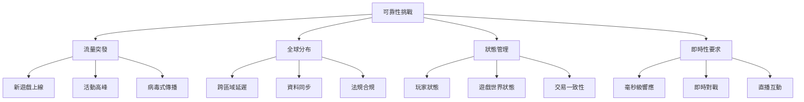

+++
title = '打造不倒的遊戲帝國：可靠性與可擴展性架構設計'
date = 2025-09-22T10:00:00+08:00
draft = false
tags = ['AWS', '高可用架構', '自動擴展', '災難復原', '負載平衡', '遊戲架構']
categories = ['技術筆記']
author = 'Jack'
description = '探討如何運用 AWS Well-Architected Framework 的可靠性支柱，構建能承載百萬級玩家的高可用遊戲架構'
toc = true
weight = 4
+++

## 前言

想像一下：您的遊戲突然爆紅，玩家數量在 24 小時內從 1 萬暴增到 100 萬。您的架構能否承受這樣的衝擊？或者在黑色星期五促銷活動中，數百萬玩家同時湧入，您的系統會崩潰還是優雅地擴展？本文將深入探討如何構建一個既可靠又可擴展的遊戲架構，確保您的遊戲在任何情況下都能穩定運行。

## 可靠性的核心概念

### 遊戲產業的可靠性挑戰



### 可靠性指標定義

| 指標 | 目標值 | 計算方式 | 業務影響 |
|-----|-------|---------|---------|
| 可用性 (Availability) | 99.99% | (總時間 - 停機時間) / 總時間 | 每年停機 < 52.56 分鐘 |
| MTBF (平均故障間隔) | > 720 小時 | 總運行時間 / 故障次數 | 月均故障 < 1 次 |
| MTTR (平均恢復時間) | < 5 分鐘 | 總恢復時間 / 故障次數 | 快速恢復服務 |
| RPO (恢復點目標) | < 1 分鐘 | 可接受的最大資料損失時間 | 最小化資料損失 |
| RTO (恢復時間目標) | < 15 分鐘 | 系統恢復的最大時間 | 快速業務恢復 |

## 高可用架構設計

### 多層次高可用架構

```python
# high_availability_architecture.py
import boto3
from typing import Dict, List, Optional
import json
from datetime import datetime

class HighAvailabilityArchitecture:
    def __init__(self):
        self.ec2 = boto3.client('ec2')
        self.elbv2 = boto3.client('elbv2')
        self.route53 = boto3.client('route53')
        self.rds = boto3.client('rds')
        self.dynamodb = boto3.client('dynamodb')

    def design_multi_tier_ha(self) -> Dict:
        """
        設計多層高可用架構
        """
        architecture = {
            'global_layer': self._design_global_layer(),
            'regional_layer': self._design_regional_layer(),
            'availability_zone_layer': self._design_az_layer(),
            'instance_layer': self._design_instance_layer(),
            'data_layer': self._design_data_layer()
        }

        return architecture

    def _design_global_layer(self) -> Dict:
        """
        全球層級設計 - Route 53 + CloudFront
        """
        return {
            'dns': {
                'service': 'Route 53',
                'routing_policies': [
                    {
                        'type': 'geolocation',
                        'purpose': '根據地理位置路由'
                    },
                    {
                        'type': 'weighted',
                        'purpose': '流量分配和金絲雀部署'
                    },
                    {
                        'type': 'failover',
                        'purpose': '自動故障轉移'
                    },
                    {
                        'type': 'latency',
                        'purpose': '最低延遲路由'
                    }
                ],
                'health_checks': {
                    'interval': 30,
                    'threshold': 3,
                    'timeout': 5
                }
            },
            'cdn': {
                'service': 'CloudFront',
                'origin_failover': True,
                'cache_behaviors': [
                    {
                        'path': '/static/*',
                        'ttl': 86400
                    },
                    {
                        'path': '/api/*',
                        'ttl': 0,
                        'forward_headers': ['Authorization', 'X-Game-Session']
                    }
                ]
            }
        }

    def _design_regional_layer(self) -> Dict:
        """
        區域層級設計 - 多區域部署
        """
        regions = ['us-east-1', 'eu-west-1', 'ap-northeast-1']
        regional_config = {}

        for region in regions:
            regional_config[region] = {
                'vpc': {
                    'cidr': f'10.{regions.index(region)}.0.0/16',
                    'availability_zones': 3,
                    'nat_gateways': 3,
                    'vpn_connections': 2
                },
                'load_balancers': {
                    'alb': {
                        'cross_zone': True,
                        'deletion_protection': True,
                        'access_logs': True
                    },
                    'nlb': {
                        'static_ip': True,
                        'preserve_client_ip': True
                    }
                },
                'auto_scaling': {
                    'min_capacity': 3,
                    'max_capacity': 100,
                    'target_metrics': {
                        'cpu': 70,
                        'memory': 80,
                        'concurrent_users': 1000
                    }
                }
            }

        return regional_config

    def implement_circuit_breaker(self) -> Dict:
        """
        實施斷路器模式
        """
        circuit_breaker_config = {
            'states': {
                'closed': {
                    'description': '正常運行',
                    'failure_threshold': 5,
                    'success_threshold': 2
                },
                'open': {
                    'description': '服務降級',
                    'timeout': 60,
                    'fallback_enabled': True
                },
                'half_open': {
                    'description': '測試恢復',
                    'test_requests': 3,
                    'evaluation_period': 30
                }
            },
            'monitoring': {
                'metrics': ['error_rate', 'latency', 'timeout_rate'],
                'alerting': {
                    'sns_topic': 'arn:aws:sns:region:account:circuit-breaker-alerts'
                }
            }
        }

        return circuit_breaker_config
```

### 遊戲狀態管理與同步

```python
# game_state_management.py
import asyncio
from typing import Dict, List, Any
import redis
import json
from datetime import datetime, timedelta

class GameStateManager:
    def __init__(self):
        self.primary_cache = redis.Redis(host='primary.cache.aws.com', decode_responses=True)
        self.backup_cache = redis.Redis(host='backup.cache.aws.com', decode_responses=True)
        self.dynamodb = boto3.resource('dynamodb')
        self.state_table = self.dynamodb.Table('GameStates')

    async def manage_distributed_state(self, game_id: str, state_data: Dict) -> bool:
        """
        管理分散式遊戲狀態
        """
        try:
            # 1. 寫入主快取
            await self._write_to_primary_cache(game_id, state_data)

            # 2. 非同步複製到備份快取
            asyncio.create_task(self._replicate_to_backup(game_id, state_data))

            # 3. 持久化重要狀態到 DynamoDB
            if self._is_critical_state(state_data):
                await self._persist_to_dynamodb(game_id, state_data)

            # 4. 廣播狀態變更
            await self._broadcast_state_change(game_id, state_data)

            return True

        except Exception as e:
            return await self._handle_state_failure(game_id, state_data, e)

    async def _write_to_primary_cache(self, game_id: str, state_data: Dict):
        """
        寫入主快取並設置 TTL
        """
        pipeline = self.primary_cache.pipeline()

        # 使用 Redis 事務確保原子性
        pipeline.multi()

        # 儲存遊戲狀態
        pipeline.hset(f"game:{game_id}", mapping={
            'state': json.dumps(state_data),
            'timestamp': datetime.now().isoformat(),
            'version': state_data.get('version', 1)
        })

        # 設置過期時間（活躍遊戲 1 小時，非活躍 10 分鐘）
        ttl = 3600 if self._is_active_game(game_id) else 600
        pipeline.expire(f"game:{game_id}", ttl)

        # 更新索引
        pipeline.zadd('active_games', {game_id: datetime.now().timestamp()})

        pipeline.execute()

    def implement_state_reconciliation(self) -> Dict:
        """
        實施狀態調和機制
        """
        reconciliation_strategy = {
            'conflict_resolution': {
                'strategy': 'last_write_wins',
                'alternative_strategies': [
                    'version_vector',
                    'operational_transform',
                    'custom_merge_function'
                ]
            },
            'sync_intervals': {
                'realtime_game': 100,  # 毫秒
                'turn_based': 1000,    # 毫秒
                'persistent_world': 5000  # 毫秒
            },
            'consistency_model': {
                'type': 'eventual_consistency',
                'convergence_time': 500,  # 毫秒
                'anti_entropy_interval': 30000  # 毫秒
            }
        }

        return reconciliation_strategy
```

## 彈性擴展策略

### 智能自動擴展系統

```python
# auto_scaling_system.py
import boto3
from typing import Dict, List, Tuple
import numpy as np
from sklearn.linear_model import LinearRegression
from datetime import datetime, timedelta

class IntelligentAutoScaling:
    def __init__(self):
        self.autoscaling = boto3.client('autoscaling')
        self.cloudwatch = boto3.client('cloudwatch')
        self.gamelift = boto3.client('gamelift')
        self.ml_model = self._initialize_ml_model()

    def setup_predictive_scaling(self) -> Dict:
        """
        設置預測性擴展
        """
        # 收集歷史資料
        historical_data = self._collect_historical_metrics()

        # 訓練預測模型
        prediction_model = self._train_prediction_model(historical_data)

        # 配置擴展策略
        scaling_config = {
            'predictive_scaling': {
                'enabled': True,
                'mode': 'ForecastAndScale',
                'scheduling_buffer_time': 300,  # 提前 5 分鐘擴展
                'max_capacity_breach_behavior': 'IncreaseMaxCapacity',
                'predictive_scaling_max_capacity_behavior': 'SetMaxCapacityAboveForecast'
            },
            'target_tracking': {
                'metrics': [
                    {
                        'name': 'CPUUtilization',
                        'target': 70,
                        'scale_in_cooldown': 300,
                        'scale_out_cooldown': 60
                    },
                    {
                        'name': 'ConcurrentPlayers',
                        'target': 1000,
                        'scale_in_cooldown': 600,
                        'scale_out_cooldown': 30
                    },
                    {
                        'name': 'NetworkLatency',
                        'target': 50,  # 毫秒
                        'scale_in_cooldown': 300,
                        'scale_out_cooldown': 60
                    }
                ]
            },
            'step_scaling': {
                'policies': [
                    {
                        'name': 'aggressive_scale_out',
                        'metric': 'RequestCount',
                        'steps': [
                            {'lower': 1000, 'upper': 2000, 'change': 2},
                            {'lower': 2000, 'upper': 5000, 'change': 5},
                            {'lower': 5000, 'upper': None, 'change': 10}
                        ]
                    }
                ]
            }
        }

        return scaling_config

    def _train_prediction_model(self, historical_data: np.array) -> LinearRegression:
        """
        訓練流量預測模型
        """
        # 特徵工程
        features = self._extract_features(historical_data)

        # 準備訓練資料
        X = features[:-1]  # 特徵
        y = historical_data[1:]  # 目標值（下一時段的流量）

        # 訓練模型
        model = LinearRegression()
        model.fit(X, y)

        # 驗證模型
        accuracy = model.score(X, y)
        print(f"Model accuracy: {accuracy:.2%}")

        return model

    def implement_game_specific_scaling(self, game_type: str) -> Dict:
        """
        實施遊戲特定的擴展策略
        """
        scaling_strategies = {
            'battle_royale': {
                'pre_match_scaling': {
                    'lobby_servers': {
                        'scale_factor': 1.5,
                        'warmup_time': 120
                    }
                },
                'match_scaling': {
                    'game_servers': {
                        'players_per_server': 100,
                        'buffer_capacity': 20
                    }
                },
                'post_match_scaling': {
                    'result_processing': {
                        'batch_size': 1000,
                        'parallel_workers': 10
                    }
                }
            },
            'mmorpg': {
                'zone_based_scaling': {
                    'high_traffic_zones': {
                        'scale_multiplier': 2.0,
                        'predictive_enabled': True
                    },
                    'low_traffic_zones': {
                        'scale_multiplier': 0.5,
                        'consolidation_enabled': True
                    }
                },
                'event_scaling': {
                    'world_boss': {
                        'pre_scale_minutes': 30,
                        'capacity_boost': 300
                    },
                    'pvp_tournament': {
                        'pre_scale_minutes': 60,
                        'capacity_boost': 500
                    }
                }
            },
            'mobile_casual': {
                'burst_scaling': {
                    'viral_detection': {
                        'threshold': 1000,  # 每分鐘新用戶
                        'scale_factor': 10
                    }
                },
                'cost_optimized_scaling': {
                    'spot_instances': True,
                    'spot_percentage': 70,
                    'on_demand_buffer': 30
                }
            }
        }

        return scaling_strategies.get(game_type, {})

    def handle_flash_crowd(self, current_load: int, predicted_load: int) -> Dict:
        """
        處理突發流量（Flash Crowd）
        """
        response_plan = {}

        load_increase_ratio = predicted_load / current_load if current_load > 0 else float('inf')

        if load_increase_ratio > 10:
            # 極端突發流量
            response_plan = {
                'action': 'emergency_scale',
                'steps': [
                    self._activate_overflow_capacity(),
                    self._enable_request_throttling(),
                    self._activate_cdn_caching(),
                    self._enable_queue_system()
                ]
            }
        elif load_increase_ratio > 5:
            # 高突發流量
            response_plan = {
                'action': 'rapid_scale',
                'steps': [
                    self._double_capacity(),
                    self._warm_up_instances(),
                    self._optimize_resource_allocation()
                ]
            }
        else:
            # 正常擴展
            response_plan = {
                'action': 'normal_scale',
                'steps': [
                    self._gradual_scale_out()
                ]
            }

        return response_plan
```

## 災難復原計畫

### 多層次災難復原架構

```python
# disaster_recovery.py
import boto3
from typing import Dict, List, Optional
from enum import Enum
import time

class DisasterRecoveryTier(Enum):
    BACKUP_RESTORE = "備份還原"
    PILOT_LIGHT = "導航燈"
    WARM_STANDBY = "溫備用"
    MULTI_SITE = "多站點主動-主動"

class DisasterRecoveryPlan:
    def __init__(self):
        self.backup = boto3.client('backup')
        self.dr_region = 'us-west-2'  # 災難復原區域
        self.primary_region = 'us-east-1'  # 主要區域

    def design_dr_strategy(self, tier: DisasterRecoveryTier) -> Dict:
        """
        設計災難復原策略
        """
        strategies = {
            DisasterRecoveryTier.BACKUP_RESTORE: self._design_backup_restore(),
            DisasterRecoveryTier.PILOT_LIGHT: self._design_pilot_light(),
            DisasterRecoveryTier.WARM_STANDBY: self._design_warm_standby(),
            DisasterRecoveryTier.MULTI_SITE: self._design_multi_site()
        }

        return strategies.get(tier)

    def _design_pilot_light(self) -> Dict:
        """
        設計導航燈模式 - 適合中型遊戲
        """
        return {
            'description': '最小化的環境，只運行核心服務',
            'rpo': '1-4 小時',
            'rto': '10-15 分鐘',
            'cost_relative': '20-30% of production',
            'architecture': {
                'always_on': [
                    'RDS Read Replica',
                    'Route 53 Health Checks',
                    'S3 Cross-Region Replication',
                    'DynamoDB Global Tables'
                ],
                'on_demand': [
                    'EC2 Instances (stopped)',
                    'Load Balancers (pre-configured)',
                    'Auto Scaling Groups (min=0)'
                ]
            },
            'activation_steps': [
                'Start EC2 instances',
                'Scale up Auto Scaling Groups',
                'Update Route 53 records',
                'Verify application health'
            ],
            'automation': {
                'runbook': 'dr-pilot-light-activation.yaml',
                'estimated_time': '10-15 minutes'
            }
        }

    def _design_warm_standby(self) -> Dict:
        """
        設計溫備用模式 - 適合大型遊戲
        """
        return {
            'description': '縮小版的完整環境，持續運行',
            'rpo': '1 分鐘',
            'rto': '5 分鐘',
            'cost_relative': '40-60% of production',
            'architecture': {
                'running_capacity': {
                    'compute': '30% of production',
                    'database': 'Multi-AZ with read replicas',
                    'cache': 'ElastiCache cluster (smaller)',
                    'messaging': 'SQS/SNS active'
                },
                'data_sync': {
                    'method': 'Continuous replication',
                    'lag': '< 1 second',
                    'validation': 'Automated integrity checks'
                }
            },
            'scaling_on_failover': {
                'auto_scaling': {
                    'target_capacity': '100% of production',
                    'scale_out_time': '2-3 minutes'
                },
                'database': {
                    'promote_read_replica': True,
                    'scale_up_instance': True
                }
            }
        }

    def implement_automated_failover(self) -> Dict:
        """
        實施自動故障轉移
        """
        failover_config = {
            'detection': {
                'health_checks': [
                    {
                        'type': 'HTTP',
                        'endpoint': '/health',
                        'interval': 30,
                        'timeout': 10,
                        'unhealthy_threshold': 2
                    },
                    {
                        'type': 'TCP',
                        'port': 443,
                        'interval': 10,
                        'timeout': 5,
                        'unhealthy_threshold': 3
                    }
                ],
                'composite_alarm': {
                    'conditions': [
                        'HealthCheck1 == ALARM',
                        'HealthCheck2 == ALARM',
                        'ResponseTime > 1000ms'
                    ],
                    'evaluation_periods': 2
                }
            },
            'decision_logic': {
                'automatic_failover': {
                    'enabled': True,
                    'conditions': [
                        'Region unavailable',
                        'Multiple AZ failure',
                        'Critical service degradation'
                    ]
                },
                'manual_approval': {
                    'required_for': [
                        'Partial failure',
                        'Performance degradation',
                        'Planned maintenance'
                    ]
                }
            },
            'execution': {
                'steps': [
                    'Validate DR environment health',
                    'Update DNS records',
                    'Scale DR resources',
                    'Verify data consistency',
                    'Enable monitoring',
                    'Notify stakeholders'
                ],
                'rollback_plan': {
                    'enabled': True,
                    'trigger': 'DR environment unhealthy',
                    'max_attempts': 3
                }
            }
        }

        return failover_config

    def test_dr_readiness(self) -> Dict:
        """
        測試災難復原準備度
        """
        test_results = {
            'backup_integrity': self._test_backup_integrity(),
            'replication_lag': self._measure_replication_lag(),
            'failover_time': self._simulate_failover(),
            'data_consistency': self._verify_data_consistency(),
            'application_health': self._test_application_health(),
            'performance_baseline': self._measure_dr_performance()
        }

        readiness_score = self._calculate_readiness_score(test_results)

        return {
            'test_results': test_results,
            'readiness_score': readiness_score,
            'recommendations': self._generate_recommendations(test_results),
            'next_test_date': (datetime.now() + timedelta(days=30)).isoformat()
        }
```

## 全球負載分配

### 智能流量管理

```python
# global_load_distribution.py
import boto3
from typing import Dict, List, Tuple
import geoip2.database
import numpy as np

class GlobalLoadDistribution:
    def __init__(self):
        self.route53 = boto3.client('route53')
        self.cloudfront = boto3.client('cloudfront')
        self.global_accelerator = boto3.client('globalaccelerator')
        self.geo_reader = geoip2.database.Reader('GeoLite2-City.mmdb')

    def setup_global_traffic_management(self) -> Dict:
        """
        設置全球流量管理
        """
        traffic_config = {
            'routing_strategy': {
                'primary': 'latency_based',
                'secondary': 'geolocation',
                'failover': 'weighted'
            },
            'regional_endpoints': self._configure_regional_endpoints(),
            'edge_locations': self._setup_edge_locations(),
            'traffic_policies': self._create_traffic_policies()
        }

        return traffic_config

    def _configure_regional_endpoints(self) -> List[Dict]:
        """
        配置區域端點
        """
        regions = [
            {
                'region': 'us-east-1',
                'endpoint': 'game-us-east.example.com',
                'capacity': 10000,
                'player_regions': ['North America', 'South America']
            },
            {
                'region': 'eu-west-1',
                'endpoint': 'game-eu-west.example.com',
                'capacity': 8000,
                'player_regions': ['Europe', 'Africa']
            },
            {
                'region': 'ap-northeast-1',
                'endpoint': 'game-ap-northeast.example.com',
                'capacity': 12000,
                'player_regions': ['Asia', 'Oceania']
            }
        ]

        for region_config in regions:
            # 配置健康檢查
            self._setup_health_check(region_config['endpoint'])

            # 配置自動擴展
            self._configure_auto_scaling(region_config['region'], region_config['capacity'])

        return regions

    def implement_smart_routing(self, player_ip: str) -> str:
        """
        實施智能路由
        """
        # 1. 獲取玩家地理位置
        location = self._get_player_location(player_ip)

        # 2. 獲取所有可用端點的狀態
        endpoints = self._get_available_endpoints()

        # 3. 計算最佳端點
        best_endpoint = self._calculate_best_endpoint(
            location,
            endpoints,
            factors={
                'latency': 0.4,
                'load': 0.3,
                'cost': 0.2,
                'player_affinity': 0.1
            }
        )

        return best_endpoint

    def _calculate_best_endpoint(self,
                                location: Dict,
                                endpoints: List[Dict],
                                factors: Dict) -> str:
        """
        計算最佳端點
        """
        scores = {}

        for endpoint in endpoints:
            # 延遲分數
            latency_score = 100 - endpoint['latency_ms']

            # 負載分數
            load_score = 100 - (endpoint['current_load'] / endpoint['max_capacity'] * 100)

            # 成本分數
            cost_score = 100 - endpoint['relative_cost']

            # 玩家親和力分數（朋友在同一伺服器）
            affinity_score = endpoint.get('friend_count', 0) * 10

            # 加權總分
            total_score = (
                latency_score * factors['latency'] +
                load_score * factors['load'] +
                cost_score * factors['cost'] +
                affinity_score * factors['player_affinity']
            )

            scores[endpoint['id']] = total_score

        # 返回得分最高的端點
        best_endpoint_id = max(scores, key=scores.get)
        return next(e['endpoint'] for e in endpoints if e['id'] == best_endpoint_id)

    def handle_regional_failure(self, failed_region: str) -> Dict:
        """
        處理區域故障
        """
        response = {
            'failed_region': failed_region,
            'timestamp': datetime.now().isoformat(),
            'actions': []
        }

        # 1. 更新 Route 53 健康檢查
        response['actions'].append(
            self._mark_region_unhealthy(failed_region)
        )

        # 2. 重新分配流量
        response['actions'].append(
            self._redistribute_traffic(failed_region)
        )

        # 3. 擴展其他區域容量
        response['actions'].append(
            self._scale_healthy_regions(failed_region)
        )

        # 4. 啟動故障區域的玩家遷移
        response['actions'].append(
            self._migrate_players(failed_region)
        )

        # 5. 通知受影響的玩家
        response['actions'].append(
            self._notify_affected_players(failed_region)
        )

        return response
```

## 混沌工程實踐

### 故障注入測試

```python
# chaos_engineering.py
import random
import boto3
from typing import Dict, List, Callable
import asyncio

class ChaosEngineering:
    def __init__(self):
        self.ssm = boto3.client('ssm')
        self.ec2 = boto3.client('ec2')
        self.experiments = []

    def design_chaos_experiments(self) -> List[Dict]:
        """
        設計混沌實驗
        """
        experiments = [
            {
                'name': 'Random Instance Termination',
                'description': '隨機終止遊戲伺服器實例',
                'blast_radius': 'single_instance',
                'frequency': 'daily',
                'method': self._terminate_random_instance
            },
            {
                'name': 'Network Latency Injection',
                'description': '注入網路延遲',
                'blast_radius': 'availability_zone',
                'frequency': 'weekly',
                'method': self._inject_network_latency
            },
            {
                'name': 'Database Failover',
                'description': '強制資料庫故障轉移',
                'blast_radius': 'regional',
                'frequency': 'monthly',
                'method': self._trigger_database_failover
            },
            {
                'name': 'Cache Flush',
                'description': '清空快取層',
                'blast_radius': 'service',
                'frequency': 'weekly',
                'method': self._flush_cache
            },
            {
                'name': 'CPU Stress',
                'description': 'CPU 壓力測試',
                'blast_radius': 'instance_group',
                'frequency': 'daily',
                'method': self._cpu_stress_test
            }
        ]

        return experiments

    async def run_game_day(self) -> Dict:
        """
        執行遊戲日演練
        """
        game_day_scenarios = [
            self._scenario_new_game_launch(),
            self._scenario_ddos_attack(),
            self._scenario_data_center_failure(),
            self._scenario_massive_player_influx()
        ]

        results = []
        for scenario in game_day_scenarios:
            result = await scenario
            results.append(result)

        return {
            'scenarios_tested': len(results),
            'successful': sum(1 for r in results if r['passed']),
            'failed': sum(1 for r in results if not r['passed']),
            'insights': self._analyze_game_day_results(results),
            'action_items': self._generate_action_items(results)
        }

    async def _scenario_new_game_launch(self) -> Dict:
        """
        模擬新遊戲上線場景
        """
        scenario_steps = [
            ('Generate traffic spike', self._generate_traffic_spike),
            ('Simulate login storm', self._simulate_login_storm),
            ('Create matchmaking bottleneck', self._create_matchmaking_bottleneck),
            ('Trigger auto-scaling', self._verify_auto_scaling),
            ('Validate player experience', self._measure_player_experience)
        ]

        results = []
        for step_name, step_function in scenario_steps:
            try:
                result = await step_function()
                results.append({
                    'step': step_name,
                    'success': True,
                    'metrics': result
                })
            except Exception as e:
                results.append({
                    'step': step_name,
                    'success': False,
                    'error': str(e)
                })

        return {
            'scenario': 'New Game Launch',
            'passed': all(r['success'] for r in results),
            'details': results
        }
```

## 實戰案例與最佳實踐

### 案例 1：Fortnite 的擴展奇蹟

Fortnite 在 2018 年達到 1250 萬同時在線玩家的驚人成就：

```python
# fortnite_scaling_strategy.py
class FortniteScalingStrategy:
    """
    Fortnite 的擴展策略分析
    """
    def __init__(self):
        self.peak_concurrent_users = 12_500_000
        self.daily_active_users = 78_300_000

    def architecture_highlights(self) -> Dict:
        return {
            'global_distribution': {
                'regions': 23,
                'edge_locations': 200,
                'dedicated_game_servers': 100000
            },
            'scaling_approach': {
                'predictive_scaling': {
                    'enabled': True,
                    'ml_models': ['time_series', 'event_based'],
                    'accuracy': 0.92
                },
                'burst_capacity': {
                    'reserved': '20%',
                    'on_demand': '30%',
                    'spot': '50%'
                }
            },
            'state_management': {
                'in_memory_cache': 'Redis Cluster',
                'persistent_storage': 'DynamoDB Global Tables',
                'sync_mechanism': 'Event sourcing'
            },
            'lessons_learned': [
                '預測性擴展比反應式擴展更有效',
                '全球分布式架構是關鍵',
                '狀態管理必須去中心化',
                '混合雲策略提供最大彈性'
            ]
        }
```

### 案例 2：League of Legends 的高可用架構

```python
# lol_reliability_architecture.py
class LeagueOfLegendsReliability:
    """
    英雄聯盟的可靠性架構
    """
    def __init__(self):
        self.monthly_active_users = 150_000_000
        self.uptime_target = 0.9999  # 99.99%

    def reliability_pillars(self) -> Dict:
        return {
            'shard_architecture': {
                'purpose': '隔離故障域',
                'shards_per_region': 10,
                'players_per_shard': 100000,
                'isolation_level': 'complete'
            },
            'riot_direct': {
                'purpose': '專用網路基礎設施',
                'coverage': '70% of players',
                'latency_reduction': '30%',
                'packet_loss_reduction': '60%'
            },
            'champion_mastery': {
                'purpose': '漸進式功能發布',
                'rollout_strategy': 'percentage_based',
                'rollback_time': '< 1 minute'
            },
            'achievements': {
                'uptime': '99.995%',
                'average_latency': '35ms',
                'incident_mttr': '4.2 minutes'
            }
        }
```

## 最佳實踐總結

### 1. 設計原則
- **故障隔離**：使用細粒度的故障域
- **優雅降級**：非關鍵功能可以關閉
- **自動恢復**：系統自愈能力
- **容量規劃**：始終保持 20-30% 的緩衝容量

### 2. 運維實踐
- **混沌工程**：定期進行故障注入測試
- **遊戲日演練**：每季度進行完整災難演練
- **監控全覆蓋**：從基礎設施到玩家體驗
- **自動化一切**：減少人為錯誤

### 3. 架構模式
- **斷路器模式**：防止級聯故障
- **艙壁模式**：隔離資源池
- **補償事務**：處理分散式事務
- **事件溯源**：可審計和可重放

### 4. 成本優化
- **混合實例策略**：結合預留、按需和 Spot
- **智能資源調度**：根據玩家模式調整
- **跨區域資源共享**：利用時區差異

## 總結

構建可靠且可擴展的遊戲架構不是一蹴而就的過程，而是需要持續的優化和演進。透過 AWS Well-Architected Framework 的指導，結合業界最佳實踐和創新技術，我們可以打造出能夠承載百萬級玩家、提供極致遊戲體驗的基礎設施。

記住，可靠性不是一個特性，而是一種文化。它需要從架構設計到日常運維的全方位投入，需要團隊的共同努力和持續改進。

## 延伸閱讀

- [AWS Well-Architected Reliability Pillar](https://docs.aws.amazon.com/wellarchitected/latest/reliability-pillar/)
- [遊戲架構可擴展性指南](https://aws.amazon.com/gametech/scalability/)
- [Netflix 的混沌工程實踐](https://netflixtechblog.com/tagged/chaos-engineering)
- [大規模多人遊戲架構](https://www.oreilly.com/library/view/massively-multiplayer-game/9781492075738/)

---

*這是 AWS 遊戲架構系列的第四篇文章。下一篇我們將深入探討「效能優化」，了解如何榨取每一滴效能，提供絲滑的遊戲體驗。*