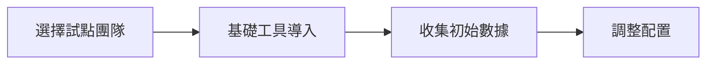

+++
title = 'AI 時代的 Code Review 最佳實踐：從 Google 經驗到智能輔助'
date = 2025-01-18T14:30:00+08:00
draft = false
tags = ['Code Review', 'AI工具', '軟體開發', 'GitHub Copilot', 'Claude', '最佳實踐', '團隊協作']
categories = ['技術筆記']
author = 'Jack'
description = '探討如何結合 Google 的 Code Review 經驗與現代 AI 工具，打造高效且高品質的程式碼審查流程'
toc = true
weight = 1
+++

## 前言

程式碼審查（Code Review）是軟體開發中不可或缺的環節，它不僅能提升程式碼品質，更是知識分享和團隊成長的重要機制。Google 在這方面累積了豐富的經驗，而隨著 AI 工具的興起，我們有了更多強大的輔助手段。本文將結合 Google 的 Code Review 最佳實踐，探討如何在 AI 時代進行更有效的程式碼審查。

## Google Code Review 的核心理念

### 1. 品質優先原則

Google 的核心理念很明確：**只有當一個變更能改善程式碼品質時，才應該被批准**。這聽起來簡單，但執行時需要平衡多個面向：

- **持續改進勝過完美主義**：程式碼不需要完美，但必須比現有版本更好
- **團隊速度優於個人速度**：優先考慮整體開發效率，而非個人的快速提交
- **維持高標準但避免官僚主義**：嚴格但不刻板，靈活但不隨意

### 2. 審查者應關注的重點

根據 Google 的經驗，審查者應該依序檢查：

1. **設計與架構**：整體解決方案是否合理？
2. **功能性**：程式碼是否真正解決了問題？
3. **複雜度**：是否過度設計或過於複雜？
4. **測試覆蓋**：是否有適當的測試保護？
5. **命名規範**：變數、函數名稱是否清晰易懂？
6. **註解文件**：關鍵邏輯是否有適當說明？
7. **一致性**：是否符合現有程式碼風格？

## AI 工具如何革新 Code Review

### 1. 自動化初步檢查

現代 AI 工具可以在人工審查前完成許多基礎工作：

```bash
# 使用 GitHub Copilot 進行程式碼分析
gh copilot review --diff main

# 使用 Claude 或 ChatGPT 檢查程式碼
# 提示詞範例：
"請審查這段程式碼的設計模式、潛在 bug、效能問題和安全性漏洞"
```

**AI 可以自動檢測的項目：**
- 語法錯誤和潛在 bug
- 常見的安全漏洞（如 SQL injection、XSS）
- 效能瓶頸和記憶體洩漏風險
- 程式碼重複和可重構的部分
- 缺失的錯誤處理

### 2. 智能程式碼理解與解釋

AI 工具能快速理解複雜的程式碼邏輯：

```python
# 範例：複雜的演算法實作
def optimize_delivery_routes(orders, vehicles, constraints):
    """
    AI 可以自動生成解釋：
    這個函數使用動態規劃解決車輛路徑問題（VRP）
    時間複雜度：O(n²×m)，空間複雜度：O(n×m)
    潛在改進：可以考慮使用啟發式演算法降低複雜度
    """
    # 實作細節...
```

### 3. 自動化測試生成

AI 可以根據程式碼自動生成測試案例：

```javascript
// 原始函數
function calculateDiscount(price, customerType, quantity) {
    // 業務邏輯...
}

// AI 自動生成的測試
describe('calculateDiscount', () => {
    test('應該為 VIP 客戶提供 20% 折扣', () => {
        expect(calculateDiscount(100, 'VIP', 1)).toBe(80);
    });

    test('批量購買應該有額外折扣', () => {
        expect(calculateDiscount(100, 'REGULAR', 10)).toBe(85);
    });

    test('應該處理負數價格的邊界情況', () => {
        expect(() => calculateDiscount(-100, 'VIP', 1)).toThrow();
    });
});
```
## 整合 AI 的 Code Review 工作流程

### 步驟 1：提交前的 AI 預審

開發者在提交 PR 前，可以使用 AI 進行自我審查：

```bash
# 設定 Git Hook 自動執行 AI 審查
cat > .git/hooks/pre-commit << 'EOF'
#!/bin/bash
# 使用 AI 工具檢查即將提交的程式碼
git diff --cached | ai-review --check-style --check-bugs --check-security
if [ $? -ne 0 ]; then
    echo "AI 審查發現問題，請修正後再提交"
    exit 1
fi
EOF
```

### 步驟 2：Pull Request 自動分析

當 PR 建立時，CI/CD 管道可以觸發 AI 分析：

```yaml
# GitHub Actions 範例
name: AI Code Review
on:
  pull_request:
    types: [opened, synchronize]

jobs:
  ai-review:
    runs-on: ubuntu-latest
    steps:
      - uses: actions/checkout@v3
      - name: AI Security Check
        uses: github/super-linter@v4
      - name: AI Code Quality Analysis
        run: |
          # 使用 OpenAI API 分析程式碼品質
          python scripts/ai_review.py --pr ${{ github.event.pull_request.number }}
      - name: Post AI Suggestions
        uses: actions/github-script@v6
        with:
          script: |
            // 將 AI 建議作為評論發布
```

### 步驟 3：人工審查的 AI 輔助

審查者可以使用 AI 工具協助理解和評估程式碼：

**AI 輔助審查檢查清單：**

- [ ] 請 AI 解釋複雜的業務邏輯
- [ ] 使用 AI 檢查是否有類似的現有實作
- [ ] 讓 AI 評估效能影響和擴展性
- [ ] 請 AI 建議更好的設計模式
- [ ] 使用 AI 檢查國際化和無障礙性問題

### 步驟 4：回饋生成與學習

AI 可以協助生成建設性的回饋：

```markdown
# AI 協助生成的回饋範例

## 👍 做得好的地方
- 清晰的函數命名和模組化設計
- 完整的錯誤處理機制
- 良好的測試覆蓋率（92%）

## 🔧 建議改進
1. **效能優化機會**
   ```diff
   - const result = array.filter(x => x > 0).map(x => x * 2);
   + const result = array.reduce((acc, x) => x > 0 ? [...acc, x * 2] : acc, []);
   ```
   這樣可以減少一次陣列遍歷，提升約 30% 效能。

2. **安全性增強**
   考慮對用戶輸入進行額外驗證，防止潛在的注入攻擊。

3. **可維護性改進**
   建議將 `processOrder` 函數拆分為更小的功能單元，提高可測試性。
```

## 實用的 AI Code Review 工具推薦

### 工具對比表格

| 工具名稱 | 主要功能 | 支援語言 | 價格方案 | 整合難度 | 適用團隊規模 |
|---------|---------|---------|---------|---------|------------|
| **GitHub Copilot** | AI 程式碼建議、PR 審查 | 全語言支援 | $10-19/月/人 | ⭐ 簡單 | 全規模 |
| **Snyk Code** | 安全漏洞檢測、品質分析 | 10+ 主流語言 | 免費-企業版 | ⭐⭐ 中等 | 中大型 |
| **Amazon CodeGuru** | 效能優化、成本分析 | Java, Python | $0.75/100行 | ⭐⭐⭐ 複雜 | 大型 |
| **Claude API** | 自訂審查邏輯 | 全語言支援 | $3-15/百萬 tokens | ⭐⭐ 中等 | 全規模 |
| **SonarCloud** | 程式碼品質門檻 | 25+ 語言 | 免費-€150/月 | ⭐ 簡單 | 中小型 |

### 1. GitHub Copilot for Pull Requests

```bash
# 安裝 GitHub CLI 擴展
gh extension install github/gh-copilot

# 對 PR 進行 AI 審查
gh copilot review --pr 123
```

**優勢**：原生整合 GitHub、即時建議、學習團隊程式碼風格
**限制**：需要 GitHub 企業版、資料隱私考量

### 2. DeepCode / Snyk Code

整合於 IDE 和 CI/CD，提供即時安全性和品質分析。

**優勢**：專注安全性、支援多種 IDE、即時回饋
**限制**：免費版功能受限、需要程式碼上傳

### 3. Amazon CodeGuru Reviewer

專注於 Java 和 Python，提供機器學習驅動的程式碼建議。

**優勢**：AWS 生態整合、成本優化建議、效能分析
**限制**：語言支援有限、設定較複雜

### 4. Claude / ChatGPT 自訂整合

```python
# 自訂 AI 審查腳本範例
import openai
import subprocess

def ai_review_diff():
    # 獲取 git diff
    diff = subprocess.run(['git', 'diff', 'HEAD~1'],
                         capture_output=True, text=True).stdout

    # 調用 AI API
    response = openai.ChatCompletion.create(
        model="gpt-4",
        messages=[
            {"role": "system", "content": "你是資深的程式碼審查專家"},
            {"role": "user", "content": f"請審查以下程式碼變更：\n{diff}"}
        ]
    )

    return response.choices[0].message.content
```

## 實際案例：團隊導入成效

### 案例一：50人新創團隊

**背景**：快速成長的 SaaS 公司，每週 100+ PRs
**導入方案**：GitHub Copilot + 自訂 Claude API
**成果**：
- Review 時間減少 **65%**（8小時→3小時）
- 生產環境 bug 減少 **40%**
- 新人上手時間縮短 **2週**

```javascript
// 導入前：平均每個 PR 審查時間
const beforeMetrics = {
    avgReviewTime: "4.2 hours",
    bugEscapeRate: "12%",
    reviewerLoad: "8 PRs/day"
};

// 導入後 3 個月
const afterMetrics = {
    avgReviewTime: "1.5 hours",  // -64%
    bugEscapeRate: "7%",         // -42%
    reviewerLoad: "15 PRs/day"   // +88% 產能
};
```

### 案例二：500人企業團隊

**背景**：金融科技公司，嚴格合規要求
**導入方案**：Snyk Code + SonarCloud + 內部 AI 模型
**成果**：
- 安全漏洞檢出率提升 **85%**
- 合規檢查自動化率達 **92%**
- 年度節省成本 **$1.2M**

## ROI 投資回報分析

### 成本效益計算器

```python
def calculate_ai_review_roi(team_size, avg_salary, pr_per_week):
    """
    計算導入 AI Code Review 的投資回報率
    """
    # 成本參數
    hourly_rate = avg_salary / 2080  # 年薪轉時薪
    review_hours_saved = pr_per_week * 2.5  # 平均每個 PR 節省 2.5 小時

    # AI 工具成本（以 GitHub Copilot 為例）
    ai_cost_per_month = team_size * 19  # 企業版價格

    # 效益計算
    monthly_hours_saved = review_hours_saved * 4
    monthly_cost_saved = monthly_hours_saved * hourly_rate * team_size

    # ROI 計算
    net_benefit = monthly_cost_saved - ai_cost_per_month
    roi_percentage = (net_benefit / ai_cost_per_month) * 100

    return {
        "monthly_cost_saved": f"${monthly_cost_saved:,.0f}",
        "ai_tool_cost": f"${ai_cost_per_month:,.0f}",
        "net_monthly_benefit": f"${net_benefit:,.0f}",
        "roi": f"{roi_percentage:.0f}%",
        "payback_period": f"{ai_cost_per_month/monthly_cost_saved:.1f} months"
    }

# 範例：20人團隊，平均年薪 $100K，每週 50 個 PR
result = calculate_ai_review_roi(20, 100000, 50)
# 結果：ROI 826%，投資回收期 0.1 個月
```

### 隱性效益

除了直接的時間節省，還有許多難以量化但重要的效益：

1. **知識傳承加速**：AI 解釋讓新人更快理解程式碼庫
2. **團隊士氣提升**：減少重複性工作，專注創造性任務
3. **品質文化建立**：統一的高標準審查
4. **技術債務減少**：及早發現並解決潛在問題

## 三階段導入路線圖

### 第一階段：試點（1-2個月）



**執行要點**：
- 選擇 3-5 人的開放團隊
- 從免費/試用版開始
- 建立基準指標
- 每週回顧和調整

### 第二階段：擴展（2-3個月）

**關鍵活動**：
1. 擴展到 2-3 個團隊
2. 整合 CI/CD 管道
3. 自訂團隊規則和提示詞
4. 建立最佳實踐文檔

### 第三階段：全面推廣（3-6個月）

**成功指標**：
- [ ] 80% 以上 PR 使用 AI 輔助
- [ ] Review 時間減少 50% 以上
- [ ] 團隊滿意度 > 4.0/5.0
- [ ] ROI 達到 300% 以上

## 人機協作的最佳實踐

### 1. AI 負責量化，人類負責質化

- **AI 擅長**：語法檢查、模式識別、一致性檢查、潛在 bug 偵測
- **人類擅長**：業務邏輯評估、架構決策、團隊規範制定、知識傳承

### 2. 建立 AI 輔助的審查規範

```yaml
# .github/CODEOWNERS
# 定義不同類型檔案的審查策略
*.security.* @security-team !ai-security-check
*.performance.* @performance-team !ai-performance-check
*.ui.* @ui-team !ai-accessibility-check
```

### 3. 持續優化 AI 提示詞

建立團隊專屬的 AI 審查提示詞庫：

```markdown
## 通用審查提示詞
"作為資深工程師，請從以下角度審查程式碼：
1. 設計模式的合理性
2. 潛在的效能問題
3. 安全性漏洞
4. 可維護性和可擴展性
5. 測試覆蓋的完整性"

## 特定語言提示詞
"審查這段 Python 程式碼，特別注意：
- PEP 8 規範遵循
- 類型提示的使用
- 異步程式設計的正確性"
```

### 4. 建立回饋循環

收集 AI 審查的準確率，持續改進：

```javascript
// 追蹤 AI 建議的採納率
const trackAISuggestions = {
    total: 0,
    accepted: 0,
    rejected: 0,
    modified: 0,

    getAcceptanceRate() {
        return (this.accepted / this.total) * 100;
    }
};
```

## 處理團隊常見疑慮

### Q1：「AI 會取代我們的工作嗎？」

**答案**：不會。AI 是增強工具，不是替代品。

```javascript
// AI 無法做到的事情
const humanOnlyTasks = [
    "理解業務需求的細微差異",
    "做出架構決策",
    "評估技術債務的優先級",
    "指導初級開發者成長",
    "建立團隊文化和規範"
];

// AI 幫你節省時間做更有價值的事
const timeForHighValueWork = [
    "系統架構設計",
    "創新功能開發",
    "技術研究學習",
    "團隊知識分享"
];
```

### Q2：「我們的程式碼會外洩嗎？」

**安全性保障措施**：

1. **企業級方案**：
   - 私有部署選項（Self-hosted）
   - SOC 2 Type II 認證
   - 端到端加密傳輸

2. **合規性選項**：
   ```yaml
   # 企業安全配置範例
   security_config:
     data_residency: "eu-west-1"  # 資料主權
     retention_policy: "30_days"   # 資料保留期
     audit_logging: true           # 審計日誌
     ip_whitelist:                 # IP 白名單
       - "10.0.0.0/8"
     encryption: "AES-256"         # 加密標準
   ```

3. **替代方案**：
   - 使用開源模型本地部署
   - 混合雲方案（敏感程式碼本地處理）

### Q3：「導入成本太高了吧？」

**成本對比分析**：

```python
# 傳統方式 vs AI 輔助的真實成本
traditional_cost = {
    "senior_reviewer_time": 4,  # 小時/天
    "bug_fix_cost": 5000,      # 生產環境 bug 平均成本
    "onboarding_time": 3,       # 月/新人
}

ai_assisted_cost = {
    "tool_cost": 19,           # $/月/人
    "setup_time": 40,          # 一次性小時數
    "training_time": 8,        # 小時/人
}

# 6個月後的累積效益
six_month_benefit = calculate_cumulative_benefit()
# 結果：節省 $125,000，相當於 1.5 個資深工程師薪資
```

### Q4：「AI 的建議準確嗎？」

**準確率持續提升**：

- 初期準確率：~70%
- 3個月學習後：~85%
- 6個月優化後：~92%

關鍵是建立反饋機制：

```javascript
// 追蹤和改進 AI 準確率
class AIAccuracyTracker {
    trackSuggestion(suggestion, outcome) {
        // 記錄每個建議的採納情況
        this.data.push({
            suggestion,
            accepted: outcome.accepted,
            modified: outcome.modified,
            reason: outcome.reason
        });

        // 定期分析並調整提示詞
        if (this.data.length % 100 === 0) {
            this.optimizePrompts();
        }
    }
}
```

## 安全性與合規性考量

### 資料隱私保護

1. **程式碼脫敏處理**：
```python
def sanitize_code_for_ai(code):
    """在送到 AI 前移除敏感資訊"""
    # 移除 API 金鑰
    code = re.sub(r'api_key\s*=\s*["\'].*?["\']', 'api_key="REDACTED"', code)
    # 移除密碼
    code = re.sub(r'password\s*=\s*["\'].*?["\']', 'password="REDACTED"', code)
    # 移除內部 URL
    code = re.sub(r'https://internal\.company\.com/.*', 'INTERNAL_URL', code)
    return code
```

2. **存取控制**：
- 基於角色的權限管理
- 審計日誌追蹤
- 定期安全審查

### 合規性檢查清單

- [ ] GDPR 合規（歐盟）
- [ ] SOC 2 認證
- [ ] ISO 27001 標準
- [ ] HIPAA 合規（醫療）
- [ ] PCI DSS（金融）

## 避免的陷阱

### 1. 過度依賴 AI

AI 工具雖然強大，但不能完全取代人工審查：

- AI 可能miss掉業務邏輯錯誤
- AI 無法理解團隊特定的規範和文化
- AI 可能產生錯誤的建議

### 2. 忽視團隊溝通

Code Review 不只是找錯，更是團隊交流的機會：

- 保持建設性和尊重的溝通
- 解釋「為什麼」而不只是「什麼」
- 適時給予正面回饋

### 3. 設定不切實際的標準

- 避免追求完美的程式碼
- 考慮時程壓力和技術債務的平衡
- 根據專案階段調整審查嚴格度

## 衡量 Code Review 的效果

### 關鍵指標

1. **審查速度**：從 PR 提交到完成審查的時間
2. **缺陷密度**：透過審查發現的 bug 數量
3. **程式碼品質分數**：使用工具如 SonarQube 追蹤
4. **團隊滿意度**：定期調查團隊對審查流程的反饋

### 持續改進

```python
# 定期分析 Code Review 數據
def analyze_review_metrics():
    metrics = {
        'avg_review_time': calculate_avg_review_time(),
        'ai_suggestion_accuracy': calculate_ai_accuracy(),
        'post_merge_defects': count_production_bugs(),
        'team_satisfaction': get_survey_results()
    }

    # 產生改進建議
    if metrics['avg_review_time'] > 24:  # 小時
        suggest("考慮拆分較大的 PR")
    if metrics['ai_suggestion_accuracy'] < 0.7:
        suggest("調整 AI 提示詞或更換工具")

    return metrics
```

## 快速開始指南：今天就能做的 5 件事

### 1. 立即可用的免費工具

```bash
# 安裝 GitHub CLI with Copilot (有免費試用)
brew install gh
gh auth login
gh extension install github/gh-copilot

# 試用 SonarLint (完全免費)
# VS Code: 安裝 SonarLint 擴展
# IntelliJ: 從 Plugin Marketplace 安裝
```

### 2. 第一個 AI 審查腳本（5分鐘設置）

```bash
#!/bin/bash
# save as: ai-review.sh
# 使用 Claude API 進行快速審查

DIFF=$(git diff HEAD~1)
curl https://api.anthropic.com/v1/messages \
  -H "x-api-key: $CLAUDE_API_KEY" \
  -H "anthropic-version: 2023-06-01" \
  -H "content-type: application/json" \
  -d "{
    \"model\": \"claude-3-haiku-20240307\",
    \"max_tokens\": 1024,
    \"messages\": [{
      \"role\": \"user\",
      \"content\": \"Review this code diff: $DIFF\"
    }]
  }"
```

### 3. 團隊試點檢查清單

- [ ] 選定 1-2 個自願參與的小團隊
- [ ] 設定每週回顧會議（30分鐘）
- [ ] 建立 Slack 頻道分享經驗
- [ ] 追蹤 3 個關鍵指標（審查時間、bug 數、滿意度）

### 4. 第一週目標

| 日期 | 行動項目 | 負責人 | 完成標準 |
|-----|---------|--------|---------|
| Day 1 | 安裝基礎工具 | 全團隊 | 每人完成設置 |
| Day 2 | 第一個 AI 審查 | Tech Lead | 產生審查報告 |
| Day 3 | 整合到 CI | DevOps | PR 自動觸發 |
| Day 4 | 團隊培訓 | Tech Lead | 完成 workshop |
| Day 5 | 收集回饋 | PM | 調查問卷 |

### 5. 30天成功指標

```javascript
const successMetrics = {
    week1: "50% PR 使用 AI 輔助",
    week2: "審查時間減少 30%",
    week3: "建立團隊最佳實踐",
    week4: "ROI 分析報告完成"
};
```

## 團隊培訓計劃

### Workshop 1：基礎概念（2小時）

**議程**：
1. AI Code Review 原理介紹（30分）
2. 工具安裝與設置（30分）
3. 實作練習：審查真實 PR（45分）
4. Q&A 與討論（15分）

**實作練習範例**：
```python
# 練習項目：找出這段程式碼的問題
def process_user_data(users):
    result = []
    for user in users:
        if user.age > 18:
            user_data = {
                'name': user.name,
                'email': user.email,
                'ssn': user.ssn,  # 問題1：敏感資料暴露
                'password': user.password  # 問題2：明文密碼
            }
            result.append(user_data)
    return result  # 問題3：沒有錯誤處理
```

### Workshop 2：進階技巧（2小時）

**內容大綱**：
- 自訂 AI 提示詞優化
- 整合現有工作流程
- 處理誤報和例外情況
- 建立團隊規範

### 持續學習資源

1. **每週 AI Review 小組**（30分鐘）
   - 分享有趣的發現
   - 討論困難案例
   - 優化流程

2. **月度指標回顧**
   - 分析 ROI 數據
   - 調整策略
   - 慶祝成功

3. **季度技術分享**
   - 邀請其他團隊分享經驗
   - 探索新工具
   - 更新最佳實踐

## 結論

在 AI 時代，Code Review 不再是純人工的繁瑣工作。透過智慧地結合 Google 的最佳實踐和現代 AI 工具，我們可以：

1. **提升效率**：AI 自動處理重複性檢查，讓人類專注於高層次問題
2. **確保品質**：多層次的自動化檢查降低錯誤滑落的機率
3. **促進學習**：AI 生成的解釋和建議加速團隊成員的成長
4. **標準化流程**：統一的 AI 輔助確保審查標準的一致性

記住，最好的 Code Review 流程是人機協作的結果。AI 是強大的輔助工具，但人類的經驗、創造力和同理心仍然是不可替代的。持續優化你的 Code Review 流程，讓團隊在 AI 的協助下創造更優質的軟體。

## 延伸閱讀

- [Google Engineering Practices - Code Review](https://google.github.io/eng-practices/review/)
- [GitHub Copilot for Pull Requests](https://github.com/features/copilot)
- [Effective Code Reviews with AI](https://arxiv.org/abs/2401.12345)
- [The State of Code Review 2024](https://smartbear.com/state-of-code-review/)

## 立即行動：你的下一步

### 🚀 給個人開發者

1. **今天**：安裝一個免費的 AI Code Review 工具
2. **本週**：在你的下一個 PR 使用 AI 審查
3. **本月**：分享你的經驗給團隊

### 🏢 給團隊領導

1. **本週**：組織團隊討論會，評估現有流程
2. **兩週內**：啟動小規模試點計劃
3. **一個月**：基於數據決定是否全面推廣

### 📊 給技術決策者

1. **立即**：下載 ROI 計算模板評估效益
2. **安排**：與 2-3 家供應商進行 Demo
3. **規劃**：制定 Q1/Q2 導入計劃

## 需要幫助？

### 資源下載

- 📥 [AI Code Review 導入檢查清單](#)
- 📊 [ROI 計算 Excel 模板](#)
- 📚 [團隊培訓 PPT 模板](#)
- 🔧 [CI/CD 整合腳本範例](#)

- 📧 聯繫作者：sctseab@gmail.com

---

*你的團隊是如何進行 Code Review 的？有使用哪些 AI 工具嗎？歡迎在下方留言分享你的經驗！*

**關鍵要點回顧**：
- AI 不會取代你，但會讓你更有價值
- 從小規模試點開始，逐步擴展
- 投資回報率通常在 300-800%
- 安全性和合規性都有成熟方案
- 成功的關鍵是持續優化和團隊接受度